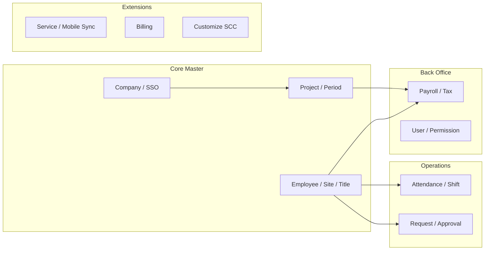

# Domain Overview

High-level grouping from exported metadata. This is a domain map, not a complete FK model.



## Domain Table Counts

| Domain | Approx. tables | Production rows | Basis |
|---|---:|---:|---|
| Employee | 225 | 3,725,460 | Table/schema names containing employee/org terms |
| Attendance | 121 | 15,371,615 | Time, shift, stamp, leave, OT names |
| Payroll | 64 | 826,401 | Payroll, tax, welfare, allowance, period names |
| Workflow | 62 | 1,275,703 | Request, rule, flow, stage, approver names |
| Security | 41 | 11,579 | User, role, menu, permission names |
| Billing | 20 | 0 | `billing` schema |
| Customize | 49 | 74,071 | `customize` schema and SCC/MOD/Trop names |

## Purpose

Give a readable starting point before opening domain-specific ER diagrams. Arrows in the diagram are limited to cross-domain links supported by exported FK rows.

## Main Tables

- `dbo.tEmployee`
- `dbo.tTimeInOut`
- `dbo.tTimeStamp`
- `dbo.tPayroll`
- `dbo.tRequest`
- `dbo.tUser`

## Key Relationships

- Declared FK metadata is sparse: 56 FK rows across 572 tables.
- `dbo.tEmployee` is the most referenced parent table with 14 inbound FK rows.
- `dbo.tShift`, `dbo.tRule`, and `dbo.tUserGroup` are also central parents in the exported FK graph.

## Business Flow

```text
Company / Project
        |
        v
Employee master
        |
        v
Attendance and requests
        |
        v
Payroll and reporting
```

## Known Issues

- Domain grouping is metadata-driven and should be reviewed with business users.
- Many obvious data flows are not declared as FK constraints in the export.
- Billing has metadata tables but no exported PK/FK rows and zero exported row counts.
