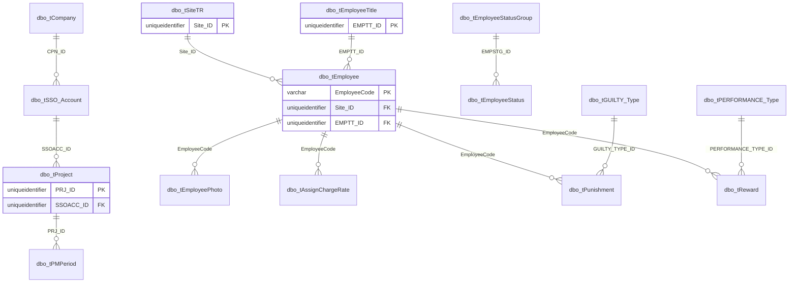

# Employee

Employee master data and organization setup.



## Purpose

Describe the declared employee-master relationships exported from MAS metadata.

## Main Tables

- `dbo.tEmployee`
- `dbo.tSiteTR`
- `dbo.tEmployeeTitle`
- `dbo.tEmployeeStatus`
- `dbo.tEmployeeStatusGroup`
- `dbo.tCompany`
- `dbo.tSSO_Account`
- `dbo.tProject`

## Key Relationships

- `tEmployee.Site_ID -> tSiteTR.Site_ID`
- `tEmployee.EMPTT_ID -> tEmployeeTitle.EMPTT_ID`
- `tEmployeeStatus.EMPSTG_ID -> tEmployeeStatusGroup.EMPSTG_ID`
- `tProject.SSOACC_ID -> tSSO_Account.SSOACC_ID`
- `tSSO_Account.CPN_ID -> tCompany.CPN_ID`

## Business Flow

```text
Company
  -> SSO account
  -> Project / payroll period
  -> Employee
  -> Employee photo / charge rate / punishment / reward
```

## Known Issues

- BU-level relationships are not exported as FK rows.
- `dbo.tEmployee` has many columns, so a separate column-level profile is recommended before migration mapping.
- Employee domain row volume is affected by log and temp tables with employee-related names.
