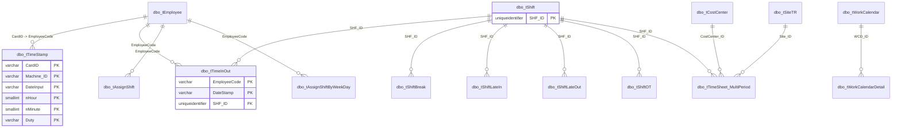

# Attendance

Attendance, timekeeping, shift, work calendar, and time sheet metadata.



## Purpose

Show declared constraints for attendance and shift-related tables.

## Main Tables

- `dbo.tTimeStamp`
- `dbo.tTimeInOut`
- `dbo.tShift`
- `dbo.tAssignShift`
- `dbo.tWorkCalendar`
- `dbo.tWorkCalendarDetail`
- `dbo.tTimeSheet_MultiPeriod`

## Key Relationships

- `tTimeStamp.CardID -> tEmployee.EmployeeCode`
- `tTimeInOut.EmployeeCode -> tEmployee.EmployeeCode`
- `tTimeInOut.SHF_ID -> tShift.SHF_ID`
- `tWorkCalendarDetail.WCD_ID -> tWorkCalendar.WCD_ID`
- `tTimeSheet_MultiPeriod` links to `tCostCenter`, `tShift`, and `tSiteTR`

## Business Flow

```text
Employee
  -> raw timestamp
  -> time in/out result
  -> shift/calendar rules
  -> time sheet / payroll preparation
```

## Known Issues

- Attendance is the largest data area in row counts.
- Some high-volume tables share natural keys but do not have exported FK rows.
- `tTimeStamp` uses `CardID` as FK to `tEmployee.EmployeeCode`, so naming is not consistent.
