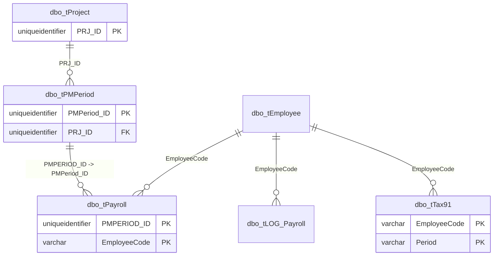

# Payroll

Payroll period, payroll result, tax, and payroll log metadata.



## Purpose

Show declared payroll relationships only.

## Main Tables

- `dbo.tPayroll`
- `dbo.tPayroll_Detail`
- `dbo.tPayroll_Tax`
- `dbo.tPayroll_Allowance`
- `dbo.tPayroll_Welfare`
- `dbo.tPMPeriod`
- `dbo.tTax91`
- `dbo.tLOG_Payroll`

## Key Relationships

- `tPayroll.EmployeeCode -> tEmployee.EmployeeCode`
- `tPayroll.PMPERIOD_ID -> tPMPeriod.PMPeriod_ID`
- `tPMPeriod.PRJ_ID -> tProject.PRJ_ID`
- `tLOG_Payroll.EmployeeCode -> tEmployee.EmployeeCode`
- `tTax91.EmployeeCode -> tEmployee.EmployeeCode`

## Business Flow

```text
Project
  -> payroll period
  -> employee payroll
  -> tax and payroll logs
```

## Known Issues

- Exported FK metadata does not include detail-table links from `tPayroll_Detail`, `tPayroll_Tax`, `tPayroll_Allowance`, or `tPayroll_Welfare` back to `tPayroll`.
- Payroll detail tables should be validated with real period-scoped seed data before migration.
- `PMPERIOD_ID` and `PMPeriod_ID` casing/naming varies by table.
