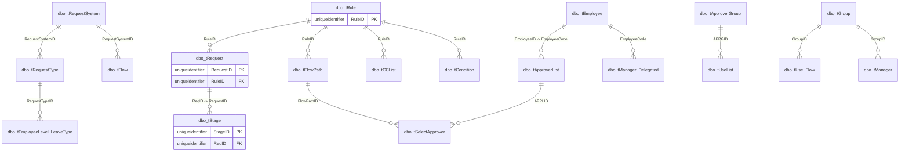

# Workflow

Request, rule, flow, stage, approver, and manager metadata.



## Purpose

Document the declared workflow and approval graph.

## Main Tables

- `dbo.tRequestSystem`
- `dbo.tRequestType`
- `dbo.tRule`
- `dbo.tRequest`
- `dbo.tStage`
- `dbo.tFlow`
- `dbo.tFlowPath`
- `dbo.tApproverList`
- `dbo.tSelectApprover`

## Key Relationships

- `tRequest.RuleID -> tRule.RuleID`
- `tStage.ReqID -> tRequest.RequestID`
- `tFlowPath.RuleID -> tRule.RuleID`
- `tSelectApprover.APPLID -> tApproverList.APPLID`
- `tSelectApprover.FlowPathID -> tFlowPath.FlowPathID`

## Business Flow

```text
Request system/type
  -> rule
  -> request
  -> stage
  -> approver selection
```

## Known Issues

- Workflow has better FK coverage than most domains, but requester/approver employee columns need column-level validation.
- Manager and delegated-manager relationships are present but should be checked against active request data.
- Some delete/update rules differ across workflow FKs.
