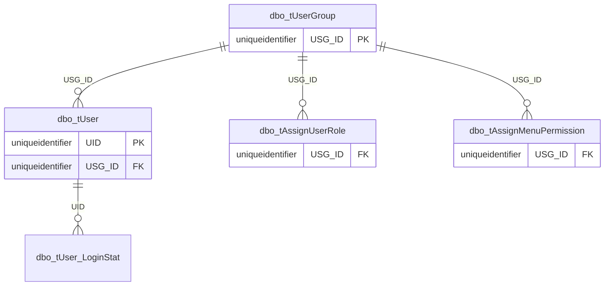

# Security

User, group, role, permission, and login metadata.



## Purpose

Show declared security relationships for account and permission setup.

## Main Tables

- `dbo.tUser`
- `dbo.tUserGroup`
- `dbo.tAssignUserRole`
- `dbo.tAssignMenuPermission`
- `dbo.tUser_LoginStat`
- `dbo.tSYSUserRole`
- `dbo.tSYS_WebMenu`

## Key Relationships

- `tUser.USG_ID -> tUserGroup.USG_ID`
- `tAssignUserRole.USG_ID -> tUserGroup.USG_ID`
- `tAssignMenuPermission.USG_ID -> tUserGroup.USG_ID`
- `tUser_LoginStat.UID -> tUser.UID`

## Business Flow

```text
User group
  -> user
  -> login status
  -> assigned role / menu permission
```

## Known Issues

- Exported FK metadata does not show role/menu master links for `tAssignUserRole` or `tAssignMenuPermission`.
- Employee-to-user mapping is not represented as a declared FK in the exported metadata.
