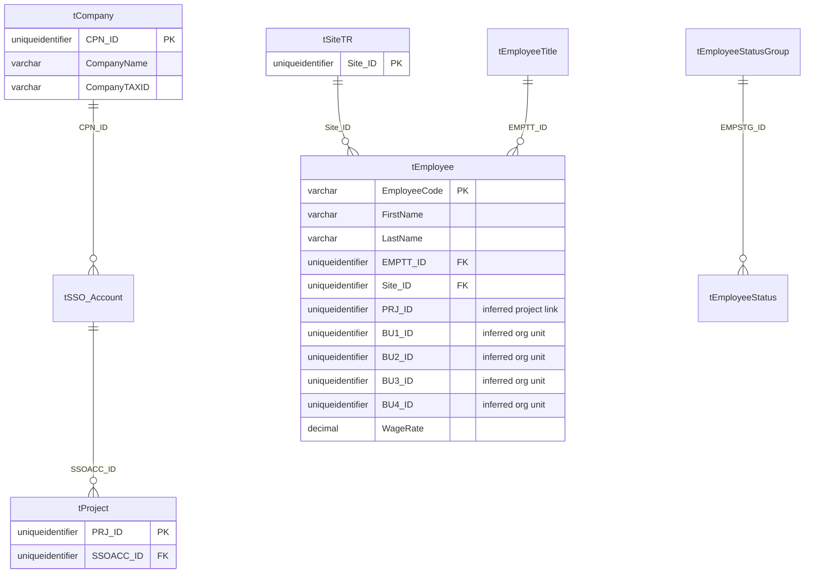
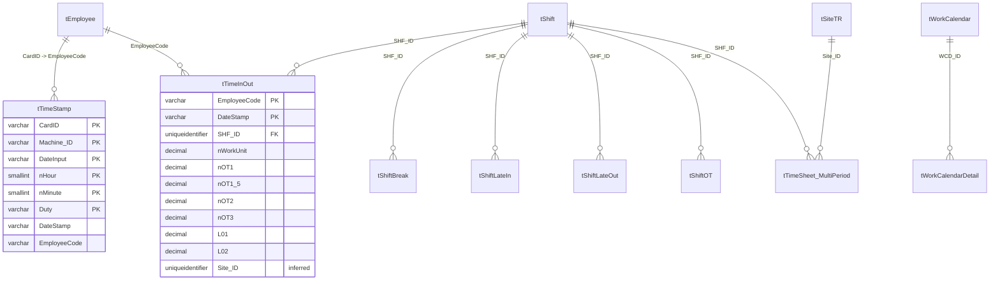
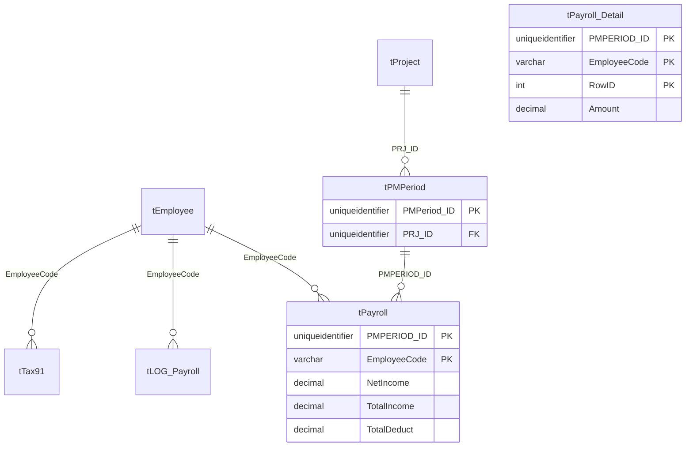
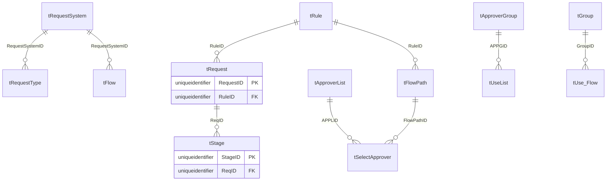
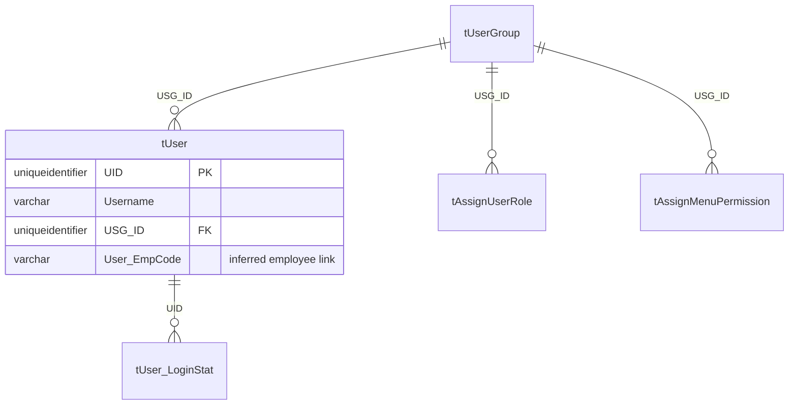
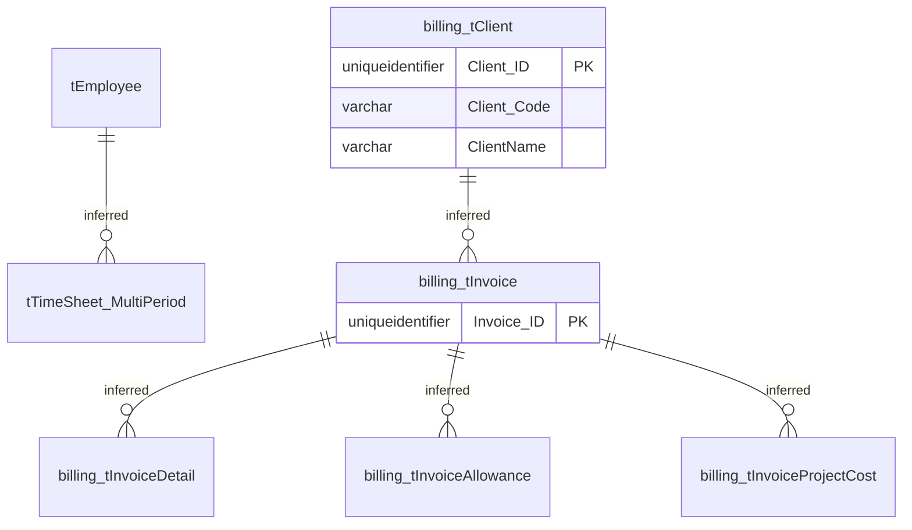

# MAS Relationship Diagrams

These diagrams combine official FK metadata from `database/metadata/export-20260713/03_foreign_keys.csv` with a few inferred links from column names. Inferred links are marked in notes, not as guaranteed constraints.

## Core HR / Organization

## Attendance / Timekeeping

## Payroll

Note: `tPayroll_Detail` appears to share the same natural key prefix as `tPayroll` (`PMPERIOD_ID`, `EmployeeCode`) plus `RowID`, but the exported FK list does not include an explicit FK from detail to payroll.

## Workflow / Approval

## Security

## Billing

Mermaid entity names cannot contain dots, so `billing.tClient` is shown as `billing_tClient`.
