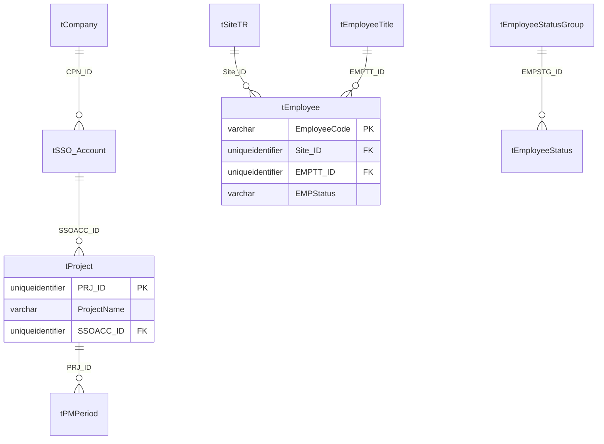
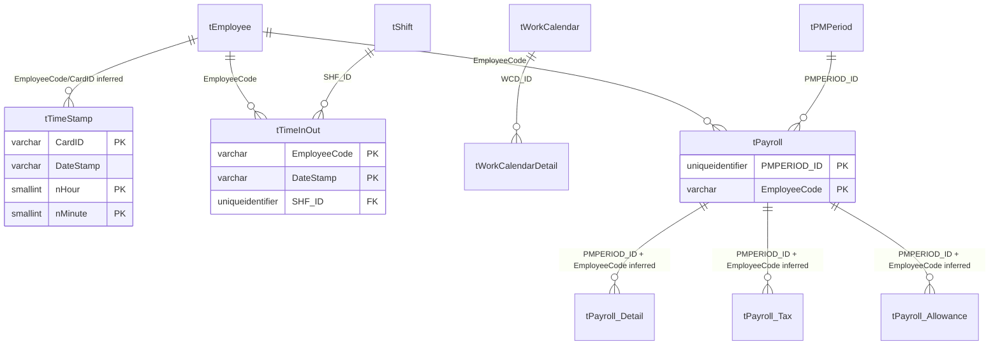
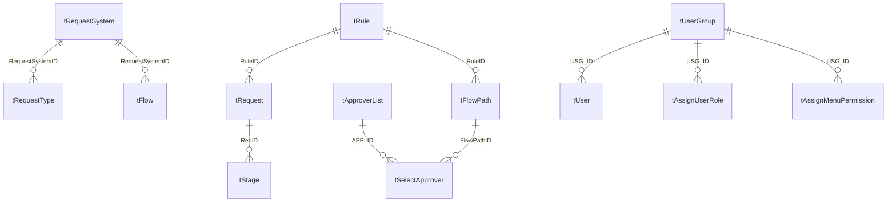
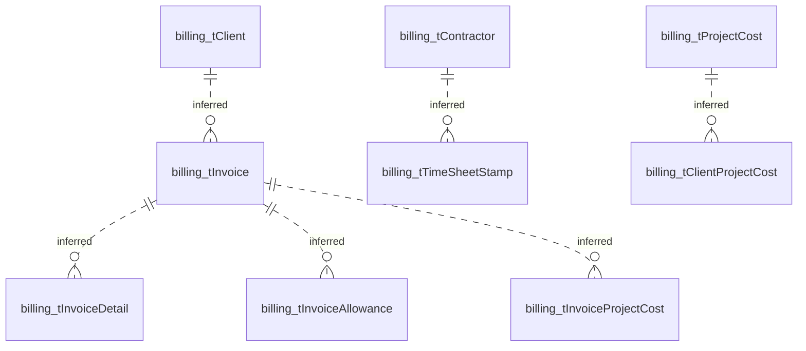

# MAS Table Relationship Analysis

This document summarizes all MAS tables from `database/metadata/export-20260713/*.csv` and validates object-level counts against the local Docker MSSQL database where possible. The Docker database is currently schema/programming objects only; production row counts come from `database/metadata/export-20260713/05_row_counts.csv`.

## Executive Summary

- Metadata export contains 572 tables and 16,216 columns; live Docker currently reports 570 tables, 437 views, 399 stored procedures, and 209 functions.
- Only 56 foreign-key rows are exported across 46 child tables and 28 parent tables, so most domain relationships must be inferred and validated before migration.
- The largest data volume is attendance/timekeeping, especially `dbo.tTimeStamp` and `dbo.tTimeInOut`.
- Core HR/payroll masters have non-zero production row counts, but the live Docker DB has 0 rows. Billing master tables are empty in the row-count export and have no PK/FK metadata, so billing needs separate sample-data confirmation.

## Object Coverage
| Schema | Tables | With PK | Without PK | Production rows |
|---|---|---|---|---|
| `dbo` | 487 | 350 | 137 | 19395188 |
| `service` | 27 | 6 | 21 | 81521 |
| `billing` | 20 | 0 | 20 | 0 |
| `customize` | 19 | 9 | 10 | 51588 |
| `rosetta` | 8 | 0 | 8 | 13 |
| `license` | 5 | 5 | 0 | 1 |
| `payroll` | 5 | 5 | 0 | 0 |
| `maspayroll` | 1 | 1 | 0 | 260 |

## Classification

| Class | Tables | Production rows |
|---|---|---|
| master/setup | 158 | 58171 |
| staging/sync | 132 | 540344 |
| attendance/leave | 70 | 13111965 |
| payroll | 40 | 720638 |
| log/audit | 38 | 4923519 |
| security | 37 | 1069 |
| workflow | 22 | 21101 |
| transaction/other | 21 | 77391 |
| billing | 20 | 0 |
| custom/customize | 19 | 51588 |
| service/mobile | 10 | 22784 |
| license/config | 5 | 1 |

## Top Production Tables

| Table | Rows | Columns | PK | FK out | FK in | Class |
|---|---|---|---|---|---|---|
| `dbo.tTimeStamp` | 7377898 | 16 | CardID, Machine_ID, DateInput, nHour, nMinute, Duty | 1 | 0 | attendance/leave |
| `dbo.tTimeInOut` | 3551128 | 320 | EmployeeCode, DateStamp | 2 | 0 | attendance/leave |
| `dbo.tLOG_EmployeeGUID` | 1984978 | 10 | ID | 0 | 0 | log/audit |
| `dbo.tTimeInOut_Data` | 1420276 | 52 | Time_EmployeeCode, Time_DateStamp | 0 | 0 | attendance/leave |
| `dbo.tLOG_OTApprove` | 1235090 | 9 | LOG_ID | 0 | 0 | log/audit |
| `dbo.tLOG_EmployeeText` | 1077517 | 11 | ID | 0 | 0 | log/audit |
| `dbo.tTimeInOut_AddLeave` | 726536 | 131 | EmployeeCode, DateStamp | 0 | 0 | attendance/leave |
| `dbo.tLOG_TimeInOut` | 402565 | 11 | LOG_ID | 0 | 0 | log/audit |
| `dbo.tTempBatchTime` | 231794 | 27 | EmployeeCode, DateStamp | 0 | 0 | staging/sync |
| `dbo.tPayroll_Detail` | 147670 | 50 | PMPERIOD_ID, EmployeeCode, RowID | 0 | 0 | payroll |
| `dbo.tPayroll_Tax` | 147619 | 35 | EmployeeCode, PMPeriod_ID | 0 | 0 | payroll |
| `dbo.tPayroll` | 147616 | 676 | PMPERIOD_ID, EmployeeCode | 2 | 0 | payroll |
| `dbo.tPayroll_Allowance` | 147616 | 184 | PMPERIOD_ID, EmployeeCode | 0 | 0 | payroll |
| `dbo.tLOG_Payroll` | 100072 | 8 | LOG_ID | 1 | 0 | log/audit |
| `dbo.tPayroll_Welfare` | 88692 | 8 | PMPeriod_ID, EmployeeCode | 0 | 0 | payroll |
| `dbo.tLogAddLeaveManagement` | 81606 | 12 | - | 0 | 0 | log/audit |
| `dbo.tTempBatch_TimeInOut` | 75864 | 131 | - | 0 | 0 | staging/sync |
| `dbo.tAutoPushTime_Tran_Manual` | 52346 | 11 | - | 0 | 0 | transaction/other |
| `dbo.tTemp_Access_AutoPushTime_MT` | 52346 | 17 | - | 0 | 0 | staging/sync |
| `dbo.tTemp_Leave` | 36101 | 75 | - | 0 | 0 | staging/sync |
| `dbo.tTemp_AutoPushTime_I_T02_Reformatted` | 24351 | 17 | - | 0 | 0 | staging/sync |
| `dbo.tTax91` | 22105 | 90 | EmployeeCode, Period | 1 | 0 | payroll |
| `dbo.tEmployee_New` | 21945 | 5 | EmployeeID | 0 | 0 | master/setup |
| `dbo.tEmployee` | 21939 | 419 | EmployeeCode | 2 | 14 | master/setup |
| `service.AppSyncConfig` | 20793 | 12 | EmployeeCode | 0 | 0 | service/mobile |

## Master Data Completeness
Completeness here means table exists, has metadata, and has non-zero production row count. It does not prove every required business value is present because the local Docker DB has no row data loaded.

| Table | Meaning | Rows | PK | Assessment |
|---|---|---|---|---|
| `dbo.tCompany` | company/legal employer | 3 | CPN_ID | OK by row-count |
| `dbo.tSSO_Account` | SSO account | 3 | SSOACC_ID | OK by row-count |
| `dbo.tProject` | payroll/project setup | 5 | PRJ_ID | OK by row-count |
| `dbo.tSiteTR` | site/work location | 187 | Site_ID | OK by row-count |
| `dbo.tBU1` | organization level 1 | 532 | BU1_ID | OK by row-count |
| `dbo.tBU2` | organization level 2 | 4 | BU2_ID | OK by row-count |
| `dbo.tBU3` | organization level 3 | 1 | BU3_ID | OK by row-count |
| `dbo.tBU4` | organization level 4 | 1 | BU4_ID | OK by row-count |
| `dbo.tCostCenter` | cost center | 3 | CostCenter_ID | OK by row-count |
| `dbo.tEmployee` | employee master | 21939 | EmployeeCode | OK by row-count |
| `dbo.tEmployeeTitle` | title/prefix/job title | 209 | EMPTT_ID | OK by row-count |
| `dbo.tEmployeeStatus` | employee status | 3 | EMPST_ID | OK by row-count |
| `dbo.tEmployeeStatusGroup` | employee status group | 3 | EMPSTG_ID | OK by row-count |
| `dbo.tEmployeeLevel` | employee level | 14 | EmpLevel_ID | OK by row-count |
| `dbo.tShift` | shift rules | 7 | SHF_ID | OK by row-count |
| `dbo.tWorkCalendar` | work calendar header | 3 | WCD_ID | OK by row-count |
| `dbo.tWorkCalendarDetail` | work calendar dates | 945 | WCD_ID, WCDDate | OK by row-count |
| `dbo.tPMPeriod` | payroll period | 150 | PMPeriod_ID | OK by row-count |
| `dbo.tPayroll_ColDef` | payroll column definitions | 1790 | UID, PRJ_ID, Fieldname | OK by row-count |
| `dbo.tTaxRate` | tax rate | 32 | id | OK by row-count |
| `dbo.tBankMaster` | bank master | 56 | Bank_ID | OK by row-count |
| `dbo.tRequestSystem` | request system | 8 | RequestSystemID | OK by row-count |
| `dbo.tRequestType` | request type | 43 | RequestTypeID | OK by row-count |
| `dbo.tRule` | workflow rule | 29 | RuleID | OK by row-count |
| `dbo.tFlow` | workflow flow | 29 | FlowID | OK by row-count |
| `dbo.tFlowPath` | workflow path | 29 | FlowPathID | OK by row-count |
| `dbo.tUser` | user account | 87 | UID | OK by row-count |
| `dbo.tUserGroup` | user group | 7 | USG_ID | OK by row-count |
| `billing.tClient` | billing client | 0 | - | Empty in row-count export; no PK exported |
| `billing.tContractor` | billing contractor | 0 | - | Empty in row-count export; no PK exported |
| `billing.tAllowance` | billing allowance | 0 | - | Empty in row-count export; no PK exported |
| `billing.tProjectCost` | billing project cost | 0 | - | Empty in row-count export; no PK exported |
| `customize.tSCC_SettingIncentive` | SCC incentive setup | 3400 | Site_ID, EMPTT_ID | OK by row-count |
| `customize.tSCC_SettingPayAllowance` | SCC pay allowance setup | 2 | Site_ID, ROW_ID | OK by row-count |
| `service.AppSyncConfig` | app sync config | 20793 | EmployeeCode | OK by row-count |

## Relationship Model
### Declared FK Coverage
- Declared FKs: 56 exported rows.
- Child tables with declared FKs: 46.
- Parent tables referenced by declared FKs: 28.
- Most referenced parent is `dbo.tEmployee` with 14 inbound FKs; next is `dbo.tShift` with 6.

### Key Relationship Table
| Relationship area | Master key | Dependent tables/columns | Confidence note |
|---|---|---|---|
| Employee core | `dbo.tEmployee.EmployeeCode` | `tTimeStamp.CardID/EmployeeCode`, `tTimeInOut.EmployeeCode`, `tPayroll.EmployeeCode`, request requester columns | Partly declared FK; many high-volume links are naming-based. |
| Payroll period | `dbo.tPMPeriod.PMPeriod_ID` | `tPayroll.PMPERIOD_ID`, `tPayroll_Detail.PMPERIOD_ID`, `tPayroll_Tax.PMPeriod_ID`, `tPayroll_Allowance.PMPERIOD_ID` | `tPayroll` has FK; detail/tax/allowance need validation. |
| Project | `dbo.tProject.PRJ_ID` | `tPMPeriod.PRJ_ID`, charge-rate, GL, tax setup tables | Core setup; project row count is small. |
| Site | `dbo.tSiteTR.Site_ID` | `tEmployee.Site_ID`, `tShift.Site_ID`, customize site-transfer tables | Site is master for location and custom transfer flows. |
| Shift | `dbo.tShift.SHF_ID` | `tTimeInOut.SHF_ID`, `tAssignShift`, shift detail tables | Declared FK exists for attendance result. |
| Workflow | `tRequestSystem`, `tRequestType`, `tRule`, `tFlow`, `tFlowPath` | `tRequest`, `tStage`, `tSelectApprover`, `tUse_Flow` | Good declared FK coverage compared with other domains. |
| Security | `tUserGroup.USG_ID`, `tUser.UID` | `tAssignUserRole`, `tAssignMenuPermission`, `tUser_LoginStat` | Declared FK coverage exists for core permission tables. |
| Billing | `billing.tClient`, `billing.tContractor`, `billing.tInvoice` | `billing.tInvoiceDetail`, allowance/project-cost tables | No PK/FK exported for billing schema; needs inferred validation. |

### Declared FK List
| Child column | Parent column | FK name | Delete rule |
|---|---|---|---|
| `dbo.tApproverList.EmployeeID` | `dbo.tEmployee.EmployeeCode` | `FK_tApproverList_tEmployee` | CASCADE |
| `dbo.tAssignChargeRate.EmployeeCode` | `dbo.tEmployee.EmployeeCode` | `FK_tAssignChargeRate_tEmployee` | CASCADE |
| `dbo.tAssignMenuPermission.USG_ID` | `dbo.tUserGroup.USG_ID` | `FK_tAssignMenuPermission_tUserGroup` | CASCADE |
| `dbo.tAssignShift.EmployeeCode` | `dbo.tEmployee.EmployeeCode` | `FK_tAssignShift_tEmployee` | CASCADE |
| `dbo.tAssignShiftByWeekDay.EmployeeCode` | `dbo.tEmployee.EmployeeCode` | `FK_tAssignShiftByWeekDay_tEmployee` | CASCADE |
| `dbo.tAssignUserRole.USG_ID` | `dbo.tUserGroup.USG_ID` | `FK_tAssignUserRole_tUserGroup` | CASCADE |
| `dbo.tCCList.RuleID` | `dbo.tRule.RuleID` | `FK_tCCList_tRule` | NO_ACTION |
| `dbo.tCondition.RuleID` | `dbo.tRule.RuleID` | `FK_tCondition_tRule` | NO_ACTION |
| `dbo.tEmployee.EMPTT_ID` | `dbo.tEmployeeTitle.EMPTT_ID` | `FK_tEmployee_tEmployeeTitle` | CASCADE |
| `dbo.tEmployee.Site_ID` | `dbo.tSiteTR.Site_ID` | `FK_tEmployee_tSiteTR` | CASCADE |
| `dbo.tEmployeeLevel_LeaveType.RequestTypeID` | `dbo.tRequestType.RequestTypeID` | `FK_tEmployeeLevel_LeaveType_tRequestType` | NO_ACTION |
| `dbo.tEmployeePhoto.EmployeeCode` | `dbo.tEmployee.EmployeeCode` | `FK_tEmployeePhoto_tEmployee` | CASCADE |
| `dbo.tEmployeeStatus.EMPSTG_ID` | `dbo.tEmployeeStatusGroup.EMPSTG_ID` | `FK_tEmployeeStatus_tEmployeeStatusGroup` | CASCADE |
| `dbo.tEmployeeWork_Quota.EMPLLT_ID` | `dbo.tEmployeeLevel_LeaveType.EMPLLT_ID` | `FK_tEmployeeWork_Quota_tEmployeeLevel_LeaveType` | NO_ACTION |
| `dbo.tFlow.RequestSystemID` | `dbo.tRequestSystem.RequestSystemID` | `FK_tFlow_tRequestSystem` | SET_NULL |
| `dbo.tFlowPath.RuleID` | `dbo.tRule.RuleID` | `FK_tFlowPath_tRule` | NO_ACTION |
| `dbo.tImportPlan.EmployeeCode` | `dbo.tImportPlan.EmployeeCode` | `FK_tTemp_ImportPlan_tTemp_ImportPlan` | NO_ACTION |
| `dbo.tImportPlan.DateStamp` | `dbo.tImportPlan.DateStamp` | `FK_tTemp_ImportPlan_tTemp_ImportPlan` | NO_ACTION |
| `dbo.tLOG_Payroll.EmployeeCode` | `dbo.tEmployee.EmployeeCode` | `FK_tLOG_Payroll_tEmployee` | CASCADE |
| `dbo.tManager.GroupID` | `dbo.tGroup.GroupID` | `FK_tManager_tGroup` | CASCADE |
| `dbo.tManager_Delegated.EmployeeCode` | `dbo.tEmployee.EmployeeCode` | `FK_tManager_Delegated_Delete` | NO_ACTION |
| `dbo.tManager_Delegated.EmployeeCode` | `dbo.tEmployee.EmployeeCode` | `FK_tManager_Delegated_Update` | CASCADE |
| `dbo.tPayroll.EmployeeCode` | `dbo.tEmployee.EmployeeCode` | `FK_tPayroll_tEmployee` | CASCADE |
| `dbo.tPayroll.PMPERIOD_ID` | `dbo.tPMPeriod.PMPeriod_ID` | `FK_tPayroll_tPMPeriod` | NO_ACTION |
| `dbo.tPMPeriod.PRJ_ID` | `dbo.tProject.PRJ_ID` | `FK_tPMPeriod_tProject` | NO_ACTION |
| `dbo.tProject.SSOACC_ID` | `dbo.tSSO_Account.SSOACC_ID` | `FK_tProject_tBranch` | CASCADE |
| `dbo.tPunishment.EmployeeCode` | `dbo.tEmployee.EmployeeCode` | `FK_tPunishment_tEmployee` | CASCADE |
| `dbo.tPunishment.GUILTY_TYPE_ID` | `dbo.tGUILTY_Type.GUILTY_TYPE_ID` | `FK_tPunishment_tGUILTY_Type` | CASCADE |
| `dbo.tReim.REIM_TYPE_ID` | `dbo.tReimType.REIM_TYPE_ID` | `FK_tReim_tReimType` | CASCADE |
| `dbo.tReimRef.REIM_ID` | `dbo.tReim.REIM_ID` | `FK_tReimRef_tReim` | CASCADE |
| `dbo.tRequest.RuleID` | `dbo.tRule.RuleID` | `FK_tRequest_tRule` | NO_ACTION |
| `dbo.tRequestType.RequestSystemID` | `dbo.tRequestSystem.RequestSystemID` | `FK_tRequestType_tRequestSystem` | SET_NULL |
| `dbo.tReward.EmployeeCode` | `dbo.tEmployee.EmployeeCode` | `FK_tReward_tEmployee` | CASCADE |
| `dbo.tReward.PERFORMANCE_TYPE_ID` | `dbo.tPERFORMANCE_Type.PERFORMANCE_TYPE_ID` | `FK_tReward_tPERFORMANCE_Type` | CASCADE |
| `dbo.tSelectApprover.APPLID` | `dbo.tApproverList.APPLID` | `FK_tSelectApprover_tApproverList` | CASCADE |
| `dbo.tSelectApprover.FlowPathID` | `dbo.tFlowPath.FlowPathID` | `FK_tSelectApprover_tFlowPath` | NO_ACTION |
| `dbo.tShiftBreak.SHF_ID` | `dbo.tShift.SHF_ID` | `FK_tShiftBreak_tShift` | CASCADE |
| `dbo.tShiftLateIn.SHF_ID` | `dbo.tShift.SHF_ID` | `FK_tShiftLateIn_tShift` | CASCADE |
| `dbo.tShiftLateOut.SHF_ID` | `dbo.tShift.SHF_ID` | `FK_tShiftLateOut_tShift` | CASCADE |
| `dbo.tShiftOT.SHF_ID` | `dbo.tShift.SHF_ID` | `FK_tShiftOT_tShift` | CASCADE |
| `dbo.tSiteUpdate.SiteUpdatePlanID` | `dbo.tSiteUpdatePlan.ID` | `FK_dbo.tSiteUpdate_dbo.tSiteUpdatePlan_SiteUpdatePlanID` | NO_ACTION |
| `dbo.tSiteUpdatePlan.PredecessorID` | `dbo.tSiteUpdatePlan.ID` | `FK_dbo.tSiteUpdatePlan_dbo.tSiteUpdatePlan_PredecessorID` | NO_ACTION |
| `dbo.tSSO_Account.CPN_ID` | `dbo.tCompany.CPN_ID` | `FK_tSSO_Account_tCompany` | CASCADE |
| `dbo.tStage.ReqID` | `dbo.tRequest.RequestID` | `FK_tStage_tRequest` | NO_ACTION |
| `dbo.tTax91.EmployeeCode` | `dbo.tEmployee.EmployeeCode` | `FK_tTax91_tEmployee` | CASCADE |
| `dbo.tTimeInOut.EmployeeCode` | `dbo.tEmployee.EmployeeCode` | `FK_tTimeInOut_tEmployee` | CASCADE |
| `dbo.tTimeInOut.SHF_ID` | `dbo.tShift.SHF_ID` | `FK_tTimeInOut_tShift` | CASCADE |
| `dbo.tTimeSheet_MultiPeriod.CostCenter_ID` | `dbo.tCostCenter.CostCenter_ID` | `FK_tTimeSheet_MultiPeriod_tCostCenter` | CASCADE |
| `dbo.tTimeSheet_MultiPeriod.SHF_ID` | `dbo.tShift.SHF_ID` | `FK_tTimeSheet_MultiPeriod_tShift` | CASCADE |
| `dbo.tTimeSheet_MultiPeriod.Site_ID` | `dbo.tSiteTR.Site_ID` | `FK_tTimeSheet_MultiPeriod_tSiteTR` | CASCADE |
| `dbo.tTimeStamp.CardID` | `dbo.tEmployee.EmployeeCode` | `FK_tTimeStamp_tEmployee` | CASCADE |
| `dbo.tUse_Flow.GroupID` | `dbo.tGroup.GroupID` | `FK_tUse_Flow_tGroup` | NO_ACTION |
| `dbo.tUseList.APPGID` | `dbo.tApproverGroup.APPGID` | `FK_tUseList_tApproverGroup` | NO_ACTION |
| `dbo.tUser.USG_ID` | `dbo.tUserGroup.USG_ID` | `FK_tUser_tUserGroup` | CASCADE |
| `dbo.tUser_LoginStat.UID` | `dbo.tUser.UID` | `FK_tUser_LoginStat_tUser` | CASCADE |
| `dbo.tWorkCalendarDetail.WCD_ID` | `dbo.tWorkCalendar.WCD_ID` | `FK_tWorkCalendarDetail_tWorkCalendar` | CASCADE |

## Mermaid Diagrams
### Core Master Setup

### Attendance And Payroll

### Workflow And Security

### Billing Gap Map

Billing schema has 20 tables, zero exported PKs, zero declared FKs, and zero production row counts in the current metadata package. Treat this as a gap until billing sample data is exported.

## Views
The live Docker database contains 437 views. Schema distribution:
| Schema | Views |
|---|---|
| `dbo` | 329 |
| `outpay_report` | 41 |
| `customize` | 36 |
| `outpay_form` | 12 |
| `payroll` | 8 |
| `service` | 6 |
| `billing` | 4 |
| `maspayroll` | 1 |
Functional grouping by view name pattern:
| View group | Approx. view count |
|---|---|
| employee/profile | 116 |
| attendance/shift/leave/OT | 105 |
| payroll/tax/SSO/PVF/GL | 127 |
| report-facing | 66 |
| workflow/manager/request/approve | 18 |
| billing | 7 |
Representative view families to inspect next: `vEmployee*`, `vTimeInOut*`, `vLeave*`, `vMTDPayroll*`, `vGLAccount*`, `vMAN_*`, `customize.vSCC_*`, `billing.vInvoiceData`, and `outpay_report` report views.

### View Catalog

This catalog is extracted from `database/schema/master/MAS_02_programmability.sql`, which contains 441 view definitions. The live Docker import currently reports 437 views, so treat the four-definition difference as an import/source-package reconciliation item.

#### `billing` (4)
- `billing.vClientData`
- `billing.vContractorData`
- `billing.vInvoiceData`
- `billing.vProjectCostData`

#### `customize` (36)
- `customize.ConsecutiveAbsence`
- `customize.vGetData_EN`
- `customize.vGetData_TH`
- `customize.vListEmpTypeAll_SCC`
- `customize.vListSiteAll_SCC`
- `customize.vMOD_SettingIncentive`
- `customize.vMOD_SettingIncentive_ByEmp`
- `customize.vMOD_SiteApporve_Confirm`
- `customize.vMOD_SiteApporve_Detail`
- `customize.vPayroll_Daihen`
- `customize.vSCC_CalRateOfDate`
- `customize.vSCC_CheckStatus`
- `customize.vSCC_Employee`
- `customize.vSCC_EmployeeEmail`
- `customize.vSCC_EmployeeMember`
- `customize.vSCC_ListTimeInout`
- `customize.vSCC_ListTimeInout2`
- `customize.vSCC_PayAllowace_ByEmp`
- `customize.vSCC_PayAllowace_DetailByEmp`
- `customize.vSCC_PayAllowace_SumByEmp`
- `customize.vSCC_Report101`
- `customize.vSCC_Report102`
- `customize.vSCC_Report103`
- `customize.vSCC_Report201`
- `customize.vSCC_Report202`
- `customize.vSCC_Report203`
- `customize.vSCC_SettingIncentive`
- `customize.vSCC_SettingIncentive_ByEmp`
- `customize.vSCC_SettingPayAllowance`
- `customize.vSCC_SiteApporve_Confirm`
- `customize.vSCC_SiteApporve_Detail`
- `customize.vSCC_SiteApporve_History`
- `customize.vSCC_SiteDetail_POPUp`
- `customize.vSCC_SiteDetail_SendEmail`
- `customize.vTrop_IncentivePeriod`
- `customize.vTrop_Payroll_Incentive`

#### `dbo` (332)
- `dbo.' + @sViewName + '`
- `dbo.Outpay_ProjectPermission`
- `dbo.v_nurse`
- `dbo.vAllFlowSystem`
- `dbo.vAssignChargeRate`
- `dbo.vAssignShift`
- `dbo.vAssignShift_Temp`
- `dbo.vAssignShiftByWeekDay`
- `dbo.vAssignShiftFromPattern`
- `dbo.vAssignWorkCalendar`
- `dbo.vAutopost_log`
- `dbo.vAutoPostSchedule_TRM`
- `dbo.vBalanceLeave`
- `dbo.vBalanceLeaveCarry`
- `dbo.vBalanceLeaveCarryExpire`
- `dbo.vBalanceLeaveQuota`
- `dbo.vBILL`
- `dbo.vBILL_PreSelect`
- `dbo.vCal_nPVFWorkUnit`
- `dbo.vCal_nPVFWorkUnit_Detail`
- `dbo.vCal_Payroll_Incentive`
- `dbo.vCall_Payroll`
- `dbo.vCardOther_Detail`
- `dbo.vCardPID_Detail`
- `dbo.vCheckEntryToLine`
- `dbo.vColDef_PayrollFormat`
- `dbo.vCostAllocation`
- `dbo.vCostAllocation_Payroll`
- `dbo.vCountServiceYear_ForTax`
- `dbo.vCourse`
- `dbo.vCourseDetail`
- `dbo.vDL_tLeaveRequest`
- `dbo.vDL_tLOG_TimeInout`
- `dbo.vDL_tTimeInout`
- `dbo.vDL_tUser`
- `dbo.vDL_tUser_LoginStat`
- `dbo.vEmployee`
- `dbo.vEmployee_Basic`
- `dbo.vEmployee_CertLetter`
- `dbo.vEmployee_CertLetter_SCC`
- `dbo.vEmployee_Decoration`
- `dbo.vEmployee_Decoration_Detail`
- `dbo.vEmployee_DecorationReport`
- `dbo.vEmployee_Deduction_Children`
- `dbo.vEmployee_Experience`
- `dbo.vEmployee_Export`
- `dbo.vEmployee_ForBank`
- `dbo.vEmployee_FullFillTime`
- `dbo.vEmployee_GenPVF`
- `dbo.vEmployee_Leave`
- `dbo.vEmployee_New`
- `dbo.vEmployee_Payroll`
- `dbo.vEmployee_Preview`
- `dbo.vEmployee_Profile`
- `dbo.vEmployee_Profile_COM100006556`
- `dbo.vEmployee_Profile_COM1000080311`
- `dbo.vEmployee_Profile_COM100009403`
- `dbo.vEmployee_Profile_COM100009404`
- `dbo.vEmployee_Profile_COM1000114628`
- `dbo.vEmployee_Profile_COM100011613`
- `dbo.vEmployee_Profile_COM100011658`
- `dbo.vEmployee_Profile_COM100012952`
- `dbo.vEmployee_Profile_COM100014629`
- `dbo.vEmployee_Profile_COM133`
- `dbo.vEmployee_Profile_SCCDB01`
- `dbo.vEmployee_Profile_SCCWIN10`
- `dbo.vEmployee_Replace`
- `dbo.vEmployee_SSO`
- `dbo.vEmployee_Tax_Report`
- `dbo.vEmployee_viewshift`
- `dbo.vEmployeeFilter_MAS`
- `dbo.vEmployeeFilter_Training`
- `dbo.vEmployeeIncentiveCondition`
- `dbo.vEmployeeLeaveInfo`
- `dbo.vEmployeeQuotaLeaveInfo`
- `dbo.vGetDate_ForEmployee`
- `dbo.vGLAccount_ByProject`
- `dbo.vGLAccount_ByProject_GroupType`
- `dbo.vGLAccount_Payroll`
- `dbo.vGLAccount_Payroll_GroupType_NoCostCenter`
- `dbo.vGLAccount_Payroll_NoCostCenter`
- `dbo.vGLAccount_Payroll_Sort`
- `dbo.vGLAccount_PayrollGroupType_Sort`
- `dbo.vGLAccount_Report391`
- `dbo.vGLAccount_Report392`
- `dbo.vImportShiftPlan`
- `dbo.vIncentive_EmployeeMonthEndPeriod`
- `dbo.vIncentive_EmployeePeriod`
- `dbo.vincentive_Projectused`
- `dbo.vLateInLateOut_NoLeave`
- `dbo.vLeaveRequest`
- `dbo.vListYear`
- `dbo.vLoan`
- `dbo.vLOG_BU`
- `dbo.vLOG_Employee_D00009`
- `dbo.vLOG_Employee_M00222`
- `dbo.vLOG_Employee_M00281`
- `dbo.vLOG_Employee_M00396`
- `dbo.vLOG_Employee_M00443`
- `dbo.vLOG_Employee_M00496`
- `dbo.vLOG_Employee_New`
- `dbo.vLOG_Employee_NewReport`
- `dbo.vLOG_Employee_S0067`
- `dbo.vLOG_Employee_S0171`
- `dbo.vLOG_Employee_S0174`
- `dbo.vLOG_EmployeeGUID`
- `dbo.vLOG_EmployeeGUID_D00009`
- `dbo.vLOG_EmployeeGUID_M00222`
- `dbo.vLOG_EmployeeGUID_M00281`
- `dbo.vLOG_EmployeeGUID_M00396`
- `dbo.vLOG_EmployeeGUID_M00443`
- `dbo.vLOG_EmployeeGUID_M00496`
- `dbo.vLOG_EmployeeGUID_S0067`
- `dbo.vLOG_EmployeeGUID_S0171`
- `dbo.vLOG_EmployeeGUID_S0174`
- `dbo.vLOG_EmployeeText`
- `dbo.vLOG_EmployeeText_D00009`
- `dbo.vLOG_EmployeeText_M00222`
- `dbo.vLOG_EmployeeText_M00281`
- `dbo.vLOG_EmployeeText_M00396`
- `dbo.vLOG_EmployeeText_M00443`
- `dbo.vLOG_EmployeeText_M00496`
- `dbo.vLOG_EmployeeText_S0067`
- `dbo.vLOG_EmployeeText_S0171`
- `dbo.vLOG_EmployeeText_S0174`
- `dbo.vLog_OTCliam`
- `dbo.vLog_OTCliam_Retro`
- `dbo.vLog_Payroll`
- `dbo.vLOG_TimeInout`
- `dbo.vLog_Update_Employee`
- `dbo.vLog_UpdateAll_Detail`
- `dbo.vLog_UpdateBU`
- `dbo.vLog_UpdateLevel`
- `dbo.vLog_UpdateSite`
- `dbo.vLog_UpdateTitle`
- `dbo.vLog_UpdateWageRate`
- `dbo.vMAN_DelegatedToEmp`
- `dbo.vMAN_EmpToDelegated`
- `dbo.vMAN_EmpToManager`
- `dbo.vMAN_ManagerToEmp`
- `dbo.vManager_Delegated`
- `dbo.vManagerList`
- `dbo.vMatchAssignShift`
- `dbo.vMOD_BILLING`
- `dbo.vMOD_GM_OTApprove`
- `dbo.vMOD_Incentive_EmployeeMonthEndPeriod`
- `dbo.vMOD_Incentive_EmployeePeriod`
- `dbo.vMOD_NewJoin`
- `dbo.vMOD_Payroll_Custom`
- `dbo.vMOD_SumPayroll_Slip`
- `dbo.vMTDPayroll`
- `dbo.vMTDPayroll_MOD`
- `dbo.vMTDPayroll_SSO`
- `dbo.vMTDPayroll_Tax`
- `dbo.vMTDPayroll_Tax_PND1`
- `dbo.vMTDPayroll_Tax_PND3`
- `dbo.vNonWorking_Holiday`
- `dbo.vNonWorking_Holiday_01`
- `dbo.vNonWorking_Holiday_01_COM100005450`
- `dbo.vNonWorking_Holiday_01_COM100006556`
- `dbo.vNonWorking_Holiday_01_COM100009403`
- `dbo.vNonWorking_Holiday_01_COM100009404`
- `dbo.vNonWorking_Holiday_01_COM1000114628`
- `dbo.vNonWorking_Holiday_01_COM100011613`
- `dbo.vNonWorking_Holiday_01_COM100011658`
- `dbo.vNonWorking_Holiday_01_COM100012952`
- `dbo.vNonWorking_Holiday_01_COM1000129521`
- `dbo.vNonWorking_Holiday_01_COM100014629`
- `dbo.vNonWorking_Holiday_01_COM133`
- `dbo.vNonWorking_Holiday_01_DESKTOPCPFG9DI`
- `dbo.vNonWorking_Holiday_01_Khemchapasorn`
- `dbo.vNonWorking_Holiday_01_SCCDB01`
- `dbo.vNonWorking_Holiday_01_SCCWEB01`
- `dbo.vNonWorking_Holiday_01_SCCWIN10`
- `dbo.vNonWorking_Holiday_01_Wanthida`
- `dbo.vNonWorking_Holiday_01_webadmin`
- `dbo.vNonWorking_Holiday_01_WORAVUT`
- `dbo.vNonWorking_Holiday_CalTime01_SCCWEB01`
- `dbo.vNonWorking_Holiday_SCC`
- `dbo.vNonWorkingBatch_Holiday`
- `dbo.vOT_Replace`
- `dbo.vOTX`
- `dbo.vPaymentCash`
- `dbo.vPayroll`
- `dbo.vPayroll2`
- `dbo.vPayroll_Bank`
- `dbo.vPayroll_Bank_MODPayment`
- `dbo.vPayroll_BankHolding`
- `dbo.vPayroll_BBK`
- `dbo.vPayroll_Cashadvance`
- `dbo.vPayroll_COM100011613`
- `dbo.vPayroll_COM133`
- `dbo.vPayroll_detail`
- `dbo.vPayroll_DetailTax`
- `dbo.vPayroll_DetailTax_COM100006556`
- `dbo.vPayroll_DetailTax_COM100011613`
- `dbo.vPayroll_DetailTax_COM133`
- `dbo.vPayroll_DetailTax_SCCDB01`
- `dbo.vPayroll_DetailTax_WORAVUT`
- `dbo.vPayroll_DetailTaxPNxx`
- `dbo.vPayroll_ExportData`
- `dbo.vPayroll_ExportData_COM100006556`
- `dbo.vPayroll_ExportData_COM1000080311`
- `dbo.vPayroll_ExportData_COM100009404`
- `dbo.vPayroll_ExportData_COM100011613`
- `dbo.vPayroll_ExportData_SCCDB01`
- `dbo.vPayroll_ForCalTax`
- `dbo.vPayroll_ForGL`
- `dbo.vPayroll_ForPND3`
- `dbo.vPayroll_GenPND1`
- `dbo.vPayroll_GenPND3`
- `dbo.vPayroll_GenPND3_RDPrep`
- `dbo.vPayroll_GenPVF`
- `dbo.vPayroll_History_COM100006556`
- `dbo.vPayroll_History_COM100011613`
- `dbo.vPayroll_History_COM133`
- `dbo.vPayroll_IncomeDeduct`
- `dbo.vPayroll_JST`
- `dbo.vPayroll_JST1`
- `dbo.vPayroll_Leave_Mod`
- `dbo.vPayroll_LoadData`
- `dbo.vPayroll_PND3`
- `dbo.vPayroll_Report388`
- `dbo.vPayroll_SCCDB01`
- `dbo.vPayroll_Tax91_Detail`
- `dbo.vPayroll_Thaikurabo`
- `dbo.vPayroll_WoodWork`
- `dbo.vPayrollSummary`
- `dbo.vPayrollSumOutstandingBalance`
- `dbo.vPMPeriod`
- `dbo.vPostedBill`
- `dbo.vProjectOfCompany`
- `dbo.vPunishment`
- `dbo.vR_Employee`
- `dbo.vR_Payroll`
- `dbo.vR_TimeInOut`
- `dbo.vReportEmployee`
- `dbo.vReportEmployeeCert`
- `dbo.vReportEmployeeEducation`
- `dbo.vReportEmployeeGrade`
- `dbo.vReportEmployeeHistoryWork`
- `dbo.vReportEmployeeTraining`
- `dbo.vReportNormal_ConfigDetail`
- `dbo.vReportr282`
- `dbo.vReportr283`
- `dbo.vReportr284`
- `dbo.vReportTitleUpdate`
- `dbo.vRequest_InOutime`
- `dbo.vRequestFlowDetailActive`
- `dbo.vRequestFlowDetailHistory`
- `dbo.vReward`
- `dbo.vShift_Payment`
- `dbo.vShiftPatternGroup`
- `dbo.vSitePlan`
- `dbo.vSiteRate`
- `dbo.vSiteReport`
- `dbo.vSlip`
- `dbo.vSSO_Account`
- `dbo.vSum_CSSOCT_Current`
- `dbo.vSumAllLeave_YTD`
- `dbo.vSumWorkByMonth`
- `dbo.vSystem_Event`
- `dbo.vTax91`
- `dbo.vTax91_Report`
- `dbo.vTemp_COM100009404_vEmployee_ExtraDetail`
- `dbo.vTemp_COM100011613_vEmployee_ExtraDetail`
- `dbo.vTemp_COM100011613_vEmployee_Profile`
- `dbo.vTemp_COM133_vEmployee_Profile`
- `dbo.vTemp_Transfer`
- `dbo.vTemp_Transfer_List`
- `dbo.vTempTransfer_Log`
- `dbo.vTempTransfer_Site_Department`
- `dbo.vTime_Row`
- `dbo.vTimeAttendance`
- `dbo.vTimeAttendance_PVF`
- `dbo.vTimeInOut`
- `dbo.vTimeInOut_Allowances`
- `dbo.vTimeInOut_APS2`
- `dbo.vTimeInOut_Attendance`
- `dbo.vTimeInOut_AutoPost`
- `dbo.vTimeInOut_ByEmployee_COM100009403`
- `dbo.vTimeInOut_ByEmployee_COM100009404`
- `dbo.vTimeInOut_ByEmployee_COM100011613`
- `dbo.vTimeInOut_ByEmployee_COM100012952`
- `dbo.vTimeInOut_ByEmployee_COM100014629`
- `dbo.vTimeInOut_ForBiostar`
- `dbo.vTimeInOut_Group`
- `dbo.vTimeInOut_JSTSlip`
- `dbo.vTimeInOut_LoadData`
- `dbo.vTimeInOut_LoadFilter_COM100006556`
- `dbo.vTimeInOut_LoadFilter_COM1000080311`
- `dbo.vTimeInOut_LoadFilter_COM100009403`
- `dbo.vTimeInOut_LoadFilter_COM100009404`
- `dbo.vTimeInOut_LoadFilter_COM1000114628`
- `dbo.vTimeInOut_LoadFilter_COM100011613`
- `dbo.vTimeInOut_LoadFilter_COM100012952`
- `dbo.vTimeInOut_LoadFilter_COM100014629`
- `dbo.vTimeInOut_LoadFilter_COM133`
- `dbo.vTimeInOut_LoadFilter_SCCDB01`
- `dbo.vTimeInOut_LoadFilter_SCCWIN10`
- `dbo.vTimeInOut_Report01`
- `dbo.vTimeInOut_SCC`
- `dbo.vTimeInOutSum`
- `dbo.vTimeStamp`
- `dbo.vTimeStamp_COM100009403`
- `dbo.vTimeStamp_COM100009404`
- `dbo.vTimeStamp_COM100011613`
- `dbo.vTimeStamp_COM100012952`
- `dbo.vTraining`
- `dbo.vTraining_421`
- `dbo.vTraining_CourseGeneration`
- `dbo.vTraining_ListEmp`
- `dbo.vTrainingListName`
- `dbo.vTrainingTrainee`
- `dbo.vTrainingTrainee_Detail`
- `dbo.vtTimeSheet_MultiPeriod`
- `dbo.vUpdateWork_BU`
- `dbo.vUpdateWork_Rate`
- `dbo.vUpdateWork_Title`
- `dbo.vWF_Ben_Detail`
- `dbo.vWF_Ben_Record`
- `dbo.vWF_LOAN`
- `dbo.vWF_LOANPayment`
- `dbo.vWorkFlow_BenefitSystem`
- `dbo.vWorkFlow_CarSystem`
- `dbo.vWorkFlow_ExpenseSystem`
- `dbo.vWorkFlow_LeaveSystem`
- `dbo.vWorkFlow_OTSystem`
- `dbo.vWorkFlow_TimeSystem`
- `dbo.vWorkFlowEmployee`
- `dbo.vYTDPayroll`
- `dbo.vYTDPayroll_206`

#### `maspayroll` (1)
- `maspayroll.vEmployee_payroll`

#### `outpay_form` (12)
- `outpay_form.vKT20A_BranchList_ByCPN`
- `outpay_form.vKT20A_BranchList_BySSO`
- `outpay_form.vKT20A_Mapping_Header`
- `outpay_form.vMTDPayroll_Tax_PND3`
- `outpay_form.vMTDSSO`
- `outpay_form.vMTDTax`
- `outpay_form.vProject_Year_Selection`
- `outpay_form.vSSO_Period_Selection`
- `outpay_form.vSSO_Year_Selection`
- `outpay_form.vTax_BranchList`
- `outpay_form.vTax_Year_Selection`
- `outpay_form.vYTDTax`

#### `outpay_report` (41)
- `outpay_report.vEmployee_r124`
- `outpay_report.vEmployee_r146`
- `outpay_report.vEmployee_r147`
- `outpay_report.vExport_PND1_2_06`
- `outpay_report.vExport_PND1_2_071`
- `outpay_report.vExport_PND1A_2_06`
- `outpay_report.vExport_PND1A_2_071`
- `outpay_report.vExport_PND1A_2_090`
- `outpay_report.vExport_SSO_File`
- `outpay_report.vKT20A_ByCPN`
- `outpay_report.vKT20A_BySSO`
- `outpay_report.vKT20A_Detail_ByCPN`
- `outpay_report.vKT20A_Detail_BySSO`
- `outpay_report.vLeaveQuota_Report_EN`
- `outpay_report.vLeaveQuota_Report_TH`
- `outpay_report.vMTDPayroll_Tax_PND3`
- `outpay_report.vPayroll_r328`
- `outpay_report.vPayroll_r335`
- `outpay_report.vPayroll_r341`
- `outpay_report.vPayroll_Slip`
- `outpay_report.vPayroll_SSODetail`
- `outpay_report.vPayroll_SSOSum`
- `outpay_report.vPVF`
- `outpay_report.vSSO1_10`
- `outpay_report.vSSO1_10_1`
- `outpay_report.vSSO1_10_Detail`
- `outpay_report.vTax91_ChildDetail`
- `outpay_report.vTax91_FindChildDetail`
- `outpay_report.vTax91_MainCompanyTaxID`
- `outpay_report.vTax91_Report`
- `outpay_report.vTax91_ReportDetail`
- `outpay_report.vTax91_ReportDetail40_2`
- `outpay_report.vTAX_50_PND1`
- `outpay_report.vTAX_50_PND1_SUM`
- `outpay_report.vTaxPND1`
- `outpay_report.vTaxPND1_Detail`
- `outpay_report.vTaxPND1A`
- `outpay_report.vTaxPND1A_Detail`
- `outpay_report.vTimeInOut_r204`
- `outpay_report.vTimeInOut_r221`
- `outpay_report.vYTDPayroll_PND3`

#### `payroll` (8)
- `payroll.vKT20A_ByCPN`
- `payroll.vKT20A_BySSO`
- `payroll.vKT20A_Summary_ByCPN`
- `payroll.vKT20A_Summary_BySSO`
- `payroll.vMTDPayroll`
- `payroll.vMTDSSO`
- `payroll.vPayroll_PND3`
- `payroll.vYTDPayroll`

#### `service` (7)
- `service.v50WtcSending`
- `service.vOvertimes`
- `service.vPaySlipsPrepare`
- `service.vPaySlipsSending`
- `service.vPaySlipsSending_All`
- `service.vSlipMobile`
- `service.vTimeAttendances`

## Recommended Next Work
1. Import a focused seed dataset for master tables, not the whole production dataset. Start with company, project, site, employee, shift, calendar, period, payroll, request/workflow tables.
2. Generate inferred relationship candidates from column names ending in `_ID`, `EmployeeCode`, `PMPeriod_ID`, `Site_ID`, `PRJ_ID`, and compare them with sample data cardinality.
3. Split migration work by bounded context: HR master, attendance, payroll, workflow, security, then billing/custom. Attendance should be isolated early because it dominates data volume.
4. For PostgreSQL migration, create explicit FK decisions. Do not blindly reproduce missing legacy FKs; validate high-volume relationships first.
5. Build a view/procedure dependency map for `vEmployee*`, `vTimeInOut*`, `vMTDPayroll*`, and `sCAL_*`/`sBatch_*` before rewriting business logic.

## All Table Catalog

| Table | Class | Rows | Columns | PK | FK out | FK in |
|---|---|---|---|---|---|---|
| `billing.tActivityLogs` | billing | 0 | 8 | - | 0 | 0 |
| `billing.tAllowance` | billing | 0 | 14 | - | 0 | 0 |
| `billing.tBillBook` | billing | 0 | 9 | - | 0 | 0 |
| `billing.tClient` | billing | 0 | 31 | - | 0 | 0 |
| `billing.tClientAllowance` | billing | 0 | 11 | - | 0 | 0 |
| `billing.tClientProjectCost` | billing | 0 | 11 | - | 0 | 0 |
| `billing.tClientType` | billing | 0 | 7 | - | 0 | 0 |
| `billing.tContractor` | billing | 0 | 8 | - | 0 | 0 |
| `billing.tContractorAllowance` | billing | 0 | 9 | - | 0 | 0 |
| `billing.tContractorProjectCost` | billing | 0 | 9 | - | 0 | 0 |
| `billing.tCountry` | billing | 0 | 7 | - | 0 | 0 |
| `billing.tInvoice` | billing | 0 | 17 | - | 0 | 0 |
| `billing.tInvoiceAllowance` | billing | 0 | 18 | - | 0 | 0 |
| `billing.tInvoiceDetail` | billing | 0 | 8 | - | 0 | 0 |
| `billing.tInvoiceProjectCost` | billing | 0 | 18 | - | 0 | 0 |
| `billing.tMultiCurrency` | billing | 0 | 22 | - | 0 | 0 |
| `billing.tProjectCost` | billing | 0 | 12 | - | 0 | 0 |
| `billing.tSetting_PeriodDays` | billing | 0 | 6 | - | 0 | 0 |
| `billing.tTemp_TimeSheetStamp` | billing | 0 | 15 | - | 0 | 0 |
| `billing.tTimeSheetStamp` | billing | 0 | 15 | - | 0 | 0 |
| `customize.TimeScan_BioStar` | custom/customize | 0 | 24 | Temp_Id | 0 | 0 |
| `customize.tInfoExportGroup` | custom/customize | 6 | 8 | - | 0 | 0 |
| `customize.tInfoExportGroupDetail` | custom/customize | 87 | 10 | - | 0 | 0 |
| `customize.tInfoExportGroupDetailSelected` | custom/customize | 0 | 4 | - | 0 | 0 |
| `customize.tLog_Tranfersite` | custom/customize | 4070 | 6 | LogID | 0 | 0 |
| `customize.tMOD_LogSetting` | custom/customize | 179 | 18 | ROW_ID | 0 | 0 |
| `customize.tMOD_SettingIncentive` | custom/customize | 0 | 12 | Site_ID, EMPTT_ID | 0 | 0 |
| `customize.tSCC_AprvSite` | custom/customize | 141 | 8 | - | 0 | 0 |
| `customize.tSCC_PayAllowance` | custom/customize | 5057 | 40 | - | 0 | 0 |
| `customize.tSCC_PaySelectPeriod` | custom/customize | 2 | 10 | - | 0 | 0 |
| `customize.tSCC_SelectFilter` | custom/customize | 6647 | 12 | - | 0 | 0 |
| `customize.tSCC_SettingIncentive` | custom/customize | 3400 | 12 | Site_ID, EMPTT_ID | 0 | 0 |
| `customize.tSCC_SettingPayAllowance` | custom/customize | 2 | 12 | Site_ID, ROW_ID | 0 | 0 |
| `customize.tSCC_TempApprove` | custom/customize | 0 | 8 | - | 0 | 0 |
| `customize.tSCC_TempApproveEmail` | custom/customize | 26 | 11 | - | 0 | 0 |
| `customize.tSCC_TranferApprove` | custom/customize | 10657 | 14 | RequestID, EmployeeCode | 0 | 0 |
| `customize.tSCC_TranferEmp` | custom/customize | 10657 | 7 | RequestID, EmployeeCode | 0 | 0 |
| `customize.tSCC_TranferSite` | custom/customize | 10657 | 12 | RequestID | 0 | 0 |
| `customize.tTropical_History_Incentive` | custom/customize | 0 | 50 | - | 0 | 0 |
| `dbo.tAddLeaveManagement` | attendance/leave | 0 | 169 | - | 0 | 0 |
| `dbo.tAssignControlGoTo` | attendance/leave | 0 | 5 | Control_ID, PRJ_ID, UID | 0 | 0 |
| `dbo.tAssignOT` | attendance/leave | 0 | 37 | RequestID, employeecode | 0 | 0 |
| `dbo.tAssignShift` | attendance/leave | 0 | 7 | EmployeeCode, DateAssign | 1 | 0 |
| `dbo.tAssignShiftByWeekDay` | attendance/leave | 0 | 4 | EmployeeCode, nWeekDay | 1 | 0 |
| `dbo.tAssignShiftFromCalendar` | attendance/leave | 0 | 13 | - | 0 | 0 |
| `dbo.tAssignTemplateSHF` | attendance/leave | 0 | 3 | - | 0 | 0 |
| `dbo.tAssignTemplateWCD` | attendance/leave | 0 | 3 | - | 0 | 0 |
| `dbo.tAssignWorkCalendar` | attendance/leave | 1 | 6 | EmployeeCode, DateAssign | 0 | 0 |
| `dbo.tCalendarYear` | attendance/leave | 3 | 7 | PMPeriod_ID | 0 | 0 |
| `dbo.tDL_tLeaveRequest` | attendance/leave | 0 | 17 | LRQ_ID | 0 | 0 |
| `dbo.tDL_tTimeInOut` | attendance/leave | 0 | 125 | EmployeeCode, DateStamp | 0 | 0 |
| `dbo.tDetailAssignShiftWhirl` | attendance/leave | 0 | 6 | ID_DSW | 0 | 0 |
| `dbo.tEmployeeLevel_LeaveType` | attendance/leave | 12 | 3 | EMPLLT_ID | 1 | 1 |
| `dbo.tEmployeePhoto` | attendance/leave | 16440 | 6 | EmployeeCode | 1 | 0 |
| `dbo.tEmployeeTitle_LeaveQuota` | attendance/leave | 0 | 19 | EMPTT_ID | 0 | 0 |
| `dbo.tEmployeeWork_Quota` | attendance/leave | 22 | 5 | EMPWQ_ID | 1 | 0 |
| `dbo.tEmployee_LeaveQuota` | attendance/leave | 12087 | 101 | - | 0 | 0 |
| `dbo.tEmployee_OtherCard` | attendance/leave | 2282 | 10 | Id | 0 | 0 |
| `dbo.tImport_Leave_MappingPreset` | attendance/leave | 0 | 17 | MAP_ID | 0 | 0 |
| `dbo.tImport_Leave_MappingPreset_New` | attendance/leave | 0 | 24 | MAP_ID | 0 | 0 |
| `dbo.tLeaveGroup` | attendance/leave | 0 | 22 | LG_ID | 0 | 0 |
| `dbo.tLeaveGroupDetail` | attendance/leave | 0 | 9 | ID | 0 | 0 |
| `dbo.tLeaveReasonOption` | attendance/leave | 0 | 6 | - | 0 | 0 |
| `dbo.tLeaveRequest` | attendance/leave | 0 | 17 | LRQ_ID | 0 | 0 |
| `dbo.tOTCompensate_Permission` | attendance/leave | 0 | 6 | - | 0 | 0 |
| `dbo.tOTHoliday` | attendance/leave | 0 | 5 | - | 0 | 0 |
| `dbo.tOTRequest_Form` | attendance/leave | 0 | 12 | OTRF_ID | 0 | 0 |
| `dbo.tOTRequest_Form_SHFPeriod` | attendance/leave | 0 | 4 | OTRF_SHFPeriodID, OTRF_ID, SHF_ID | 0 | 0 |
| `dbo.tOTRequest_Time` | attendance/leave | 5 | 13 | OT_ID | 0 | 0 |
| `dbo.tOTx` | attendance/leave | 0 | 11 | OT_ID | 0 | 0 |
| `dbo.tOther1` | attendance/leave | 0 | 5 | Other1_ID | 0 | 0 |
| `dbo.tOther2` | attendance/leave | 0 | 5 | Other2_ID | 0 | 0 |
| `dbo.tOther3` | attendance/leave | 0 | 5 | Other3_ID | 0 | 0 |
| `dbo.tOther4` | attendance/leave | 0 | 5 | Other4_ID | 0 | 0 |
| `dbo.tOther5` | attendance/leave | 0 | 5 | Other5_ID | 0 | 0 |
| `dbo.tOther_FieldCaption` | attendance/leave | 1 | 21 | ROW_ID | 0 | 0 |
| `dbo.tPreset_Leave` | attendance/leave | 1 | 29 | LPS_ID | 0 | 0 |
| `dbo.tRequest_OT_Process` | attendance/leave | 8 | 41 | RowID | 0 | 0 |
| `dbo.tShift` | attendance/leave | 7 | 172 | SHF_ID | 0 | 6 |
| `dbo.tShiftBreak` | attendance/leave | 0 | 8 | SHFBREAK_ID | 1 | 0 |
| `dbo.tShiftGroup` | attendance/leave | 0 | 5 | ShiftGroup_ID | 0 | 0 |
| `dbo.tShiftLateIn` | attendance/leave | 0 | 10 | SHFLATEIN_ID | 1 | 0 |
| `dbo.tShiftLateOut` | attendance/leave | 0 | 10 | SHFLATEOUT_ID | 1 | 0 |
| `dbo.tShiftOT` | attendance/leave | 0 | 16 | SHFOT_ID | 1 | 0 |
| `dbo.tShiftPattern` | attendance/leave | 0 | 6 | ShiftPattern_ID | 0 | 0 |
| `dbo.tShiftPatternGroup` | attendance/leave | 0 | 6 | ShiftPatternGroup_ID | 0 | 0 |
| `dbo.tShiftProject` | attendance/leave | 0 | 2 | SHF_ID, PRJ_ID | 0 | 0 |
| `dbo.tShift_Filter` | attendance/leave | 0 | 3 | - | 0 | 0 |
| `dbo.tTimeCard_HideCol` | attendance/leave | 1 | 99 | UID | 0 | 0 |
| `dbo.tTimeCard_Permission` | attendance/leave | 0 | 15 | ManagerCode | 0 | 0 |
| `dbo.tTimeCard_Remark` | attendance/leave | 0 | 3 | Remark_ID | 0 | 0 |
| `dbo.tTimeInOut` | attendance/leave | 3551128 | 320 | EmployeeCode, DateStamp | 2 | 0 |
| `dbo.tTimeInOut_AddLeave` | attendance/leave | 726536 | 131 | EmployeeCode, DateStamp | 0 | 0 |
| `dbo.tTimeInOut_ColDef` | attendance/leave | 635 | 7 | UID, Fieldname | 0 | 0 |
| `dbo.tTimeInOut_Data` | attendance/leave | 1420276 | 52 | Time_EmployeeCode, Time_DateStamp | 0 | 0 |
| `dbo.tTimeInOut_FieldCaption` | attendance/leave | 1 | 61 | ROW_ID | 0 | 0 |
| `dbo.tTimeInOut_RowName` | attendance/leave | 6 | 5 | Row_Order | 0 | 0 |
| `dbo.tTimeInOut_T0xFormat` | attendance/leave | 5 | 10 | SEQNO, FieldName | 0 | 0 |
| `dbo.tTimeSheet` | attendance/leave | 0 | 11 | EmployeeCode, DateStamp | 0 | 0 |
| `dbo.tTimeSheet_InputDataList` | attendance/leave | 0 | 5 | Employeecode | 0 | 0 |
| `dbo.tTimeSheet_Log` | attendance/leave | 0 | 14 | ROW_ID | 0 | 0 |
| `dbo.tTimeSheet_MultiPeriod` | attendance/leave | 0 | 24 | RowID | 3 | 0 |
| `dbo.tTimeStamp` | attendance/leave | 7377898 | 16 | CardID, Machine_ID, DateInput, nHour, nMinute, Duty | 1 | 0 |
| `dbo.tUserWebTimeCardPermission` | attendance/leave | 10 | 6 | Id | 0 | 0 |
| `dbo.tWF_AssignQuota` | attendance/leave | 0 | 22 | EmployeeCode, Period | 0 | 0 |
| `dbo.tWorkCalendar` | attendance/leave | 3 | 5 | WCD_ID | 0 | 1 |
| `dbo.tWorkCalendarDetail` | attendance/leave | 945 | 4 | WCD_ID, WCDDate | 1 | 0 |
| `dbo.tWorkCalendarDetailTemp` | attendance/leave | 3652 | 4 | - | 0 | 0 |
| `dbo.tWorkCalendarShiftPattern` | attendance/leave | 0 | 6 | - | 0 | 0 |
| `dbo._DBMigrationHistory` | log/audit | 2825 | 4 | ID | 0 | 0 |
| `dbo.__MigrationHistory` | log/audit | 1 | 4 | MigrationId, ContextKey | 0 | 0 |
| `dbo.tDL_tLOG_TimeInOut` | log/audit | 0 | 9 | LOG_ID | 0 | 0 |
| `dbo.tLOGMidnight_OTClaimApprove` | log/audit | 0 | 17 | LOG_ID | 0 | 0 |
| `dbo.tLOG_BU` | log/audit | 1266 | 8 | ID | 0 | 0 |
| `dbo.tLOG_BU_KeyName` | log/audit | 12 | 3 | ID | 0 | 0 |
| `dbo.tLOG_CloseCarryOption` | log/audit | 16 | 6 | - | 0 | 0 |
| `dbo.tLOG_Course` | log/audit | 0 | 8 | LOG_ID | 0 | 0 |
| `dbo.tLOG_DeleteEmployee` | log/audit | 86 | 8 | LOG_ID | 0 | 0 |
| `dbo.tLOG_DeleteImportTime` | log/audit | 3201 | 9 | RowID | 0 | 0 |
| `dbo.tLOG_EmployeeGUID` | log/audit | 1984978 | 10 | ID | 0 | 0 |
| `dbo.tLOG_EmployeeText` | log/audit | 1077517 | 11 | ID | 0 | 0 |
| `dbo.tLOG_OTApprove` | log/audit | 1235090 | 9 | LOG_ID | 0 | 0 |
| `dbo.tLOG_OTClaimApprove` | log/audit | 5973 | 17 | LOG_ID | 0 | 0 |
| `dbo.tLOG_PDF` | log/audit | 10 | 11 | - | 0 | 0 |
| `dbo.tLOG_Payroll` | log/audit | 100072 | 8 | LOG_ID | 1 | 0 |
| `dbo.tLOG_ProcedureExec` | log/audit | 0 | 15 | RowID | 0 | 0 |
| `dbo.tLOG_TimeInOut` | log/audit | 402565 | 11 | LOG_ID | 0 | 0 |
| `dbo.tLOG_TimeInOutDelete` | log/audit | 2861 | 3 | - | 0 | 0 |
| `dbo.tLOG_UpdateWork_BU` | log/audit | 5225 | 12 | LOG_ID | 0 | 0 |
| `dbo.tLOG_UpdateWork_Level` | log/audit | 0 | 13 | LOG_ID | 0 | 0 |
| `dbo.tLOG_UpdateWork_Rate` | log/audit | 2504 | 10 | LOG_ID | 0 | 0 |
| `dbo.tLOG_UpdateWork_Title` | log/audit | 344 | 10 | LOG_ID | 0 | 0 |
| `dbo.tLOG_Update_Employee` | log/audit | 72 | 8 | LOG_ID | 0 | 0 |
| `dbo.tLOG_UserLogon_Outpay` | log/audit | 10399 | 3 | ID | 0 | 0 |
| `dbo.tLOG_tProjectChargeRate` | log/audit | 0 | 10 | LOG_ID | 0 | 0 |
| `dbo.tLogAddLeaveManagement` | log/audit | 81606 | 12 | - | 0 | 0 |
| `dbo.tLogImport_Attendance` | log/audit | 0 | 32 | Log_ID | 0 | 0 |
| `dbo.tLogKeyName` | log/audit | 461 | 5 | ID | 0 | 0 |
| `dbo.tLogRequest_OT_Process` | log/audit | 35 | 41 | RowID | 0 | 0 |
| `dbo.tLog_AssignShift` | log/audit | 0 | 7 | - | 0 | 0 |
| `dbo.tLog_AssignWCD` | log/audit | 1 | 7 | - | 0 | 0 |
| `dbo.tLog_EditIncentive` | log/audit | 0 | 6 | - | 0 | 0 |
| `dbo.tLog_ImportPlan` | log/audit | 338 | 9 | - | 0 | 0 |
| `dbo.tLog_OTClaim` | log/audit | 5949 | 44 | LogID | 0 | 0 |
| `dbo.tLog_Request` | log/audit | 3 | 5 | LogID | 0 | 0 |
| `dbo.tLog_RetroClaim` | log/audit | 0 | 19 | LogID | 0 | 0 |
| `dbo.tUser_PWDHistory` | log/audit | 109 | 4 | ROW_GUID | 0 | 0 |
| `dbo.TempTableBreakSHF` | master/setup | 0 | 6 | - | 0 | 0 |
| `dbo.dtproperties` | master/setup | 21 | 7 | id, property | 0 | 0 |
| `dbo.sysdiagrams` | master/setup | 3 | 5 | diagram_id | 0 | 0 |
| `dbo.tAnnouncement` | master/setup | 0 | 10 | AnnouncementID | 0 | 0 |
| `dbo.tAppConnector` | master/setup | 1 | 5 | CNT_ID | 0 | 0 |
| `dbo.tAppConnector_File` | master/setup | 0 | 5 | CNT_ID | 0 | 0 |
| `dbo.tApplication` | master/setup | 0 | 122 | ApplicationID | 0 | 0 |
| `dbo.tAssignBillRate` | master/setup | 0 | 3 | BillPeriod_ID, EmployeeCode | 0 | 0 |
| `dbo.tAssignChargeRate` | master/setup | 0 | 3 | EmployeeCode, DateAssign | 1 | 0 |
| `dbo.tAssignShifiWhirl` | master/setup | 0 | 7 | ID_SW | 0 | 0 |
| `dbo.tAutoGenID` | master/setup | 1 | 10 | AutoRun_ID | 0 | 0 |
| `dbo.tAutoPostSchedule` | master/setup | 0 | 72 | APS_ID | 0 | 0 |
| `dbo.tAutoPostSchedule_TRM` | master/setup | 0 | 110 | APS_ID | 0 | 0 |
| `dbo.tAward_Type` | master/setup | 1 | 3 | Award_TYPE_ID | 0 | 0 |
| `dbo.tBU1` | master/setup | 532 | 6 | BU1_ID | 0 | 0 |
| `dbo.tBU1_New` | master/setup | 560 | 2 | ID | 0 | 0 |
| `dbo.tBU2` | master/setup | 4 | 7 | BU2_ID | 0 | 0 |
| `dbo.tBU2_New` | master/setup | 13 | 2 | ID | 0 | 0 |
| `dbo.tBU3` | master/setup | 1 | 7 | BU3_ID | 0 | 0 |
| `dbo.tBU3_New` | master/setup | 1 | 2 | ID | 0 | 0 |
| `dbo.tBU4` | master/setup | 1 | 7 | BU4_ID | 0 | 0 |
| `dbo.tBU4_New` | master/setup | 1 | 2 | ID | 0 | 0 |
| `dbo.tBU_FieldCaption` | master/setup | 1 | 17 | ROW_ID | 0 | 0 |
| `dbo.tBadgeStyle` | master/setup | 1 | 3 | Badge_ID | 0 | 0 |
| `dbo.tBankBranch` | master/setup | 0 | 4 | BN_ID, BranchCode | 0 | 0 |
| `dbo.tBankMaster` | master/setup | 56 | 20 | Bank_ID | 0 | 0 |
| `dbo.tBankName` | master/setup | 36 | 6 | BN_ID | 0 | 0 |
| `dbo.tBillChargeRate` | master/setup | 1 | 33 | BILLCHR_ID | 0 | 0 |
| `dbo.tBillPeriod` | master/setup | 0 | 7 | BillPeriod_ID | 0 | 0 |
| `dbo.tBillSum_PeriodYM` | master/setup | 0 | 17 | BillPeriod_ID, Period_YM | 0 | 0 |
| `dbo.tBillSummary` | master/setup | 0 | 53 | BillSum_ID, EmployeeCode, BillPeriod_ID | 0 | 0 |
| `dbo.tCardStatus_Type` | master/setup | 4 | 3 | STATUS_TYPE_ID | 0 | 0 |
| `dbo.tCashAdvance` | master/setup | 0 | 5 | CashAdv_ID | 0 | 0 |
| `dbo.tCertificationStyle` | master/setup | 2 | 3 | Certification_ID | 0 | 0 |
| `dbo.tChangeset` | master/setup | 734 | 6 | ID | 0 | 0 |
| `dbo.tChildren_Prefix` | master/setup | 5 | 3 | ID | 0 | 0 |
| `dbo.tColDef_rBILL` | master/setup | 0 | 10 | SEQNO, FieldName | 0 | 0 |
| `dbo.tColDef_rEmployeeExport` | master/setup | 167 | 10 | SEQNO, FieldName | 0 | 0 |
| `dbo.tColDef_rEmployeeExportNew` | master/setup | 871 | 14 | ID | 0 | 0 |
| `dbo.tColDef_rPM` | master/setup | 0 | 10 | SEQNO, FieldName | 0 | 0 |
| `dbo.tCompany` | master/setup | 3 | 42 | CPN_ID | 0 | 1 |
| `dbo.tCondition` | master/setup | 0 | 5 | ConditionID | 1 | 0 |
| `dbo.tControlMOD` | master/setup | 2 | 4 | EventID | 0 | 0 |
| `dbo.tCostAllocation` | master/setup | 0 | 32 | RowID | 0 | 0 |
| `dbo.tCostCenter` | master/setup | 3 | 4 | CostCenter_ID | 0 | 1 |
| `dbo.tCostCenter_BU_Mapping` | master/setup | 0 | 4 | CostCenter_ID, BU_ID | 0 | 0 |
| `dbo.tCourse` | master/setup | 0 | 6 | Course_ID | 0 | 0 |
| `dbo.tCourseDetail` | master/setup | 0 | 9 | Row_ID | 0 | 0 |
| `dbo.tCourseGeneration` | master/setup | 0 | 23 | Gen_ID | 0 | 0 |
| `dbo.tCourseTaking` | master/setup | 0 | 5 | Gen_ID, EmployeeCode | 0 | 0 |
| `dbo.tData_PND1_Detail` | master/setup | 3 | 34 | ComputerName, CPN_ID, PID, EmployeeCode | 0 | 0 |
| `dbo.tDecoration` | master/setup | 1 | 6 | DecorationID, Decoration_Thai | 0 | 0 |
| `dbo.tEMPTP1_2_Mapping` | master/setup | 0 | 2 | EMPTP1_ID, EMPTP2_ID | 0 | 0 |
| `dbo.tEMPTP2_3_Mapping` | master/setup | 0 | 2 | EMPTP2_ID, EMPTP3_ID | 0 | 0 |
| `dbo.tEmployee` | master/setup | 21939 | 419 | EmployeeCode | 2 | 14 |
| `dbo.tEmployeeAbility` | master/setup | 8 | 19 | EmployeeCode | 0 | 0 |
| `dbo.tEmployeeBank` | master/setup | 0 | 12 | BN_ID, EmpCode | 0 | 0 |
| `dbo.tEmployeeCodeFilter` | master/setup | 0 | 5 | - | 0 | 0 |
| `dbo.tEmployeeCodeFilter_TRM` | master/setup | 0 | 5 | - | 0 | 0 |
| `dbo.tEmployeeExtraDetail` | master/setup | 0 | 20 | - | 0 | 0 |
| `dbo.tEmployeeFilter` | master/setup | 0 | 32 | SCH_ID | 0 | 0 |
| `dbo.tEmployeeFilter_TRM` | master/setup | 0 | 45 | SCH_ID | 0 | 0 |
| `dbo.tEmployeeLevel` | master/setup | 14 | 3 | EmpLevel_ID | 0 | 0 |
| `dbo.tEmployeeStatus` | master/setup | 3 | 4 | EMPST_ID | 1 | 0 |
| `dbo.tEmployeeTitle` | master/setup | 209 | 5 | EMPTT_ID | 0 | 1 |
| `dbo.tEmployeeType1` | master/setup | 5 | 3 | EMPTP1_ID | 0 | 0 |
| `dbo.tEmployeeType2` | master/setup | 1 | 4 | EMPTP2_ID | 0 | 0 |
| `dbo.tEmployeeType3` | master/setup | 2 | 4 | EMPTP3_ID | 0 | 0 |
| `dbo.tEmployeeType_FieldCaption` | master/setup | 1 | 4 | ROW_ID | 0 | 0 |
| `dbo.tEmployee_Children` | master/setup | 10 | 15 | ID | 0 | 0 |
| `dbo.tEmployee_Decoration` | master/setup | 0 | 11 | RowID | 0 | 0 |
| `dbo.tEmployee_FieldCaption` | master/setup | 1 | 15 | ROW_ID | 0 | 0 |
| `dbo.tEmployee_FirstFinance` | master/setup | 0 | 8 | - | 0 | 0 |
| `dbo.tEmployee_New` | master/setup | 21945 | 5 | EmployeeID | 0 | 0 |
| `dbo.tEmployee_RateP0x` | master/setup | 8773 | 32 | EmployeeCode | 0 | 0 |
| `dbo.tGLAccount` | master/setup | 0 | 4 | GL_AccNo, GL_AccType | 0 | 0 |
| `dbo.tGLAccount_MapField` | master/setup | 96 | 5 | SeqField, GLField | 0 | 0 |
| `dbo.tGUILTY_Type` | master/setup | 39 | 3 | GUILTY_TYPE_ID | 0 | 1 |
| `dbo.tImportPlan` | master/setup | 168 | 7 | EmployeeCode, DateStamp | 2 | 2 |
| `dbo.tImportTime_Mapping` | master/setup | 5 | 20 | ID | 0 | 0 |
| `dbo.tImport_Allowances_MappingPreset` | master/setup | 0 | 50 | MAP_ID | 0 | 0 |
| `dbo.tImport_Employee_MappingPreset` | master/setup | 9 | 161 | MAP_ID | 0 | 0 |
| `dbo.tImport_MappingPreset` | master/setup | 0 | 359 | MAP_ID | 0 | 0 |
| `dbo.tImport_WorkPlan_MappingPreset` | master/setup | 0 | 9 | MAP_ID | 0 | 0 |
| `dbo.tL0x_FieldCaption` | master/setup | 1 | 17 | ROW_ID | 0 | 0 |
| `dbo.tLevel` | master/setup | 0 | 3 | LVID | 0 | 0 |
| `dbo.tLoan` | master/setup | 0 | 15 | LOAN_ID | 0 | 0 |
| `dbo.tMODBill` | master/setup | 3 | 3 | BillPeriod_ID, BU3_ID | 0 | 0 |
| `dbo.tMOD_BUChargeRate` | master/setup | 0 | 2 | BU1_ID, BILLCHR_ID | 0 | 0 |
| `dbo.tMOD_PostedBill` | master/setup | 0 | 9 | RowID | 0 | 0 |
| `dbo.tMartialStatus` | master/setup | 5 | 3 | MTS_ID | 0 | 0 |
| `dbo.tNationality` | master/setup | 3 | 5 | NAT_ID | 0 | 0 |
| `dbo.tPENALTY_Type` | master/setup | 5 | 3 | PENALTY_TYPE_ID | 0 | 0 |
| `dbo.tPERFORMANCE_Type` | master/setup | 1 | 3 | PERFORMANCE_TYPE_ID | 0 | 1 |
| `dbo.tPMPeriod` | master/setup | 150 | 33 | PMPeriod_ID | 1 | 1 |
| `dbo.tPeriod_ChargeRate` | master/setup | 150 | 300 | PRJ_RATE_ID, PMPeriod_ID | 0 | 0 |
| `dbo.tPeriod_Retro` | master/setup | 0 | 8 | PMPeriod_ID | 0 | 0 |
| `dbo.tPrefix` | master/setup | 3 | 4 | Prefix | 0 | 0 |
| `dbo.tProject` | master/setup | 5 | 65 | PRJ_ID | 1 | 1 |
| `dbo.tProjectChargeRate` | master/setup | 5 | 1016 | PRJ_RATE_ID | 0 | 0 |
| `dbo.tProjectChargeRate_Welfare` | master/setup | 2 | 45 | PRJ_RATE_ID, PRJ_ID | 0 | 0 |
| `dbo.tProject_GLAccNo` | master/setup | 5 | 98 | PRJ_ID | 0 | 0 |
| `dbo.tProject_GLAccNoRow` | master/setup | 275 | 5 | PRJ_ID, FieldName | 0 | 0 |
| `dbo.tProvince` | master/setup | 77 | 2 | ProvinceName | 0 | 0 |
| `dbo.tPunishmentStyle` | master/setup | 3 | 3 | Punishment_ID | 0 | 0 |
| `dbo.tRC_Application` | master/setup | 0 | 92 | ApplicationID | 0 | 0 |
| `dbo.tRC_Computer` | master/setup | 0 | 5 | ApplicationID, ComputerIndex | 0 | 0 |
| `dbo.tRC_Degree` | master/setup | 0 | 9 | ApplicationID, DegreeIndex | 0 | 0 |
| `dbo.tRC_DegreeName` | master/setup | 0 | 3 | DegreeID | 0 | 0 |
| `dbo.tRC_Language` | master/setup | 0 | 5 | ApplicationID, LanguageIndex | 0 | 0 |
| `dbo.tRC_Question` | master/setup | 0 | 3 | ApplicationID, QuestionIndex | 0 | 0 |
| `dbo.tRC_Sibling` | master/setup | 0 | 7 | ApplicationID, SiblingIndex | 0 | 0 |
| `dbo.tRC_Training` | master/setup | 0 | 6 | ApplicationID, TrainingIndex | 0 | 0 |
| `dbo.tRC_WorkPlace` | master/setup | 0 | 15 | ApplicationID, WorkingIndex | 0 | 0 |
| `dbo.tRPT_ReportFilter` | master/setup | 0 | 6 | ReportFilter_ID | 0 | 0 |
| `dbo.tReportCenter_Config` | master/setup | 0 | 53 | RPT_ID, Filename | 0 | 0 |
| `dbo.tReportCustomize_Config` | master/setup | 0 | 10 | RPT_ID, Filename | 0 | 0 |
| `dbo.tReportNormal_Config` | master/setup | 46 | 57 | ReportNo, FilenameTH | 0 | 0 |
| `dbo.tReportNormal_Language` | master/setup | 46 | 59 | ReportNo | 0 | 0 |
| `dbo.tResignReason` | master/setup | 678 | 2 | RSR_ID | 0 | 0 |
| `dbo.tReward` | master/setup | 0 | 12 | RWD_ID | 2 | 0 |
| `dbo.tSCC_SubContract` | master/setup | 0 | 3 | SUB_ID | 0 | 0 |
| `dbo.tSYSDownloadFileList` | master/setup | 5 | 3 | Filename | 0 | 0 |
| `dbo.tSYSJob` | master/setup | 0 | 14 | JOB_ID | 0 | 0 |
| `dbo.tSYSMODReportFilter` | master/setup | 0 | 5 | Filter_ID, Filter_Report | 0 | 0 |
| `dbo.tSYSMODReportList` | master/setup | 1 | 7 | RPT_ID | 0 | 0 |
| `dbo.tSYSTurnOverRate` | master/setup | 8 | 2 | TurnOverRate_ID | 0 | 0 |
| `dbo.tSYS_LoadEmployeeDefault` | master/setup | 1 | 23 | RowID | 0 | 0 |
| `dbo.tSYS_RegistBank` | master/setup | 12 | 1 | BN_ID | 0 | 0 |
| `dbo.tSetting_Email` | master/setup | 1 | 8 | STE_ID | 0 | 0 |
| `dbo.tSiteRate` | master/setup | 0 | 3 | Site_ID, EmployeeCode | 0 | 0 |
| `dbo.tSiteTR` | master/setup | 187 | 6 | Site_ID | 0 | 2 |
| `dbo.tSiteTR_BU_Mapping` | master/setup | 0 | 4 | Site_ID, BU_ID | 0 | 0 |
| `dbo.tSiteTR_MappingScan` | master/setup | 0 | 3 | Site_ID, Scan_Number | 0 | 0 |
| `dbo.tSiteUpdate` | master/setup | 0 | 3 | ID | 1 | 0 |
| `dbo.tSiteUpdatePlan` | master/setup | 0 | 11 | ID | 1 | 2 |
| `dbo.tSlipStyle` | master/setup | 5 | 4 | SLIP_ID | 0 | 0 |
| `dbo.tSysConfig` | master/setup | 6 | 7 | SYSConfigKey | 0 | 0 |
| `dbo.tSysParm` | master/setup | 58 | 4 | SYSKEY | 0 | 0 |
| `dbo.tSysSettings` | master/setup | 2 | 3 | ID | 0 | 0 |
| `dbo.tSysWeekName` | master/setup | 7 | 2 | nDate | 0 | 0 |
| `dbo.tSystem_MEventName` | master/setup | 9 | 1 | EventName | 0 | 0 |
| `dbo.tTrainingCompany` | master/setup | 1 | 2 | TrainingCom_ID | 0 | 0 |
| `dbo.tTrainingMode` | master/setup | 0 | 3 | TrainingMode_ID | 0 | 0 |
| `dbo.tTrainingPerson` | master/setup | 0 | 2 | TrainingPerson_ID | 0 | 0 |
| `dbo.tTrainingPlace` | master/setup | 0 | 2 | TrainingPlace_ID | 0 | 0 |
| `dbo.tTrainingType` | master/setup | 7 | 4 | TrainingType_ID | 0 | 0 |
| `dbo.tTrainingTypeEvaluate` | master/setup | 0 | 2 | TrainingTypeEvaluate_ID | 0 | 0 |
| `dbo.tVacationLockFlag` | master/setup | 0 | 4 | ID | 0 | 0 |
| `dbo.tWF_FieldCaption` | master/setup | 1 | 21 | ROW_ID | 0 | 0 |
| `dbo.tWF_Loan` | master/setup | 0 | 17 | LOAN_ID | 0 | 0 |
| `dbo.tWF_LoanPayment` | master/setup | 0 | 12 | TRANS_ID | 0 | 0 |
| `dbo.tWF_Record` | master/setup | 0 | 7 | Record_ID | 0 | 0 |
| `dbo.tW_Option` | master/setup | 39 | 11 | nKey | 0 | 0 |
| `dbo.tWorkPeriod` | master/setup | 0 | 7 | WorkPeriod_ID | 0 | 0 |
| `dbo.tYTD_Attendance` | master/setup | 0 | 24 | YEAR, employeecode | 0 | 0 |
| `dbo.tYTD_Report_Wait_Stored` | master/setup | 0 | 4 | ID_REPORT, YEAR | 0 | 0 |
| `dbo.tvTimeAttendance_FieldCaption` | master/setup | 100 | 8 | SEQNO, FieldCaption | 0 | 0 |
| `dbo.tCal_PVF` | payroll | 0 | 4 | PMPERIOD_ID, EmployeeCode | 0 | 0 |
| `dbo.tColDef_PayrollExport` | payroll | 1584 | 17 | ROWID, SEQNO, FieldName | 0 | 0 |
| `dbo.tColDef_PayrollFormat` | payroll | 6 | 5 | ROWID | 0 | 0 |
| `dbo.tMOD_PVF_REPORT` | payroll | 0 | 12 | ID, MEMBER_ID | 0 | 0 |
| `dbo.tPVFSub` | payroll | 0 | 2 | PVFSUB_ID | 0 | 0 |
| `dbo.tPVF_ColDef` | payroll | 0 | 21 | UID, Menu_ID, CPN_ID, PRJ_ID, Fieldname, FlagType, RowFormat | 0 | 0 |
| `dbo.tPVF_Menu` | payroll | 0 | 4 | Menu_ID | 0 | 0 |
| `dbo.tPayroll` | payroll | 147616 | 676 | PMPERIOD_ID, EmployeeCode | 2 | 0 |
| `dbo.tPayrollFilter` | payroll | 0 | 8 | PRAF_ID | 0 | 0 |
| `dbo.tPayroll_Allowance` | payroll | 147616 | 184 | PMPERIOD_ID, EmployeeCode | 0 | 0 |
| `dbo.tPayroll_BankHolding` | payroll | 0 | 11 | EmployeeCode, PMPERIOD_ID | 0 | 0 |
| `dbo.tPayroll_ColDef` | payroll | 1790 | 8 | UID, PRJ_ID, Fieldname | 0 | 0 |
| `dbo.tPayroll_Detail` | payroll | 147670 | 50 | PMPERIOD_ID, EmployeeCode, RowID | 0 | 0 |
| `dbo.tPayroll_GLAccNo` | payroll | 278 | 95 | - | 0 | 0 |
| `dbo.tPayroll_GLAccNoRow` | payroll | 15290 | 10 | - | 0 | 0 |
| `dbo.tPayroll_GLAccNoRow_ByEmployee` | payroll | 0 | 15 | - | 0 | 0 |
| `dbo.tPayroll_GLAccNoRow_GroupType` | payroll | 0 | 11 | - | 0 | 0 |
| `dbo.tPayroll_GLAccNoRow_GroupType_ByEmployee` | payroll | 0 | 16 | - | 0 | 0 |
| `dbo.tPayroll_GLAccNo_ByEmployee` | payroll | 0 | 127 | PRJ_ID, PMPeriod_ID, EmployeeCode | 0 | 0 |
| `dbo.tPayroll_GLAccNo_ByEmployee_SETDATA` | payroll | 0 | 127 | PRJ_ID, PMPeriod_ID, EmployeeCode | 0 | 0 |
| `dbo.tPayroll_GLAccType_ByEmployee` | payroll | 0 | 18 | - | 0 | 0 |
| `dbo.tPayroll_T0xFormat` | payroll | 0 | 9 | SEQNO, FieldName | 0 | 0 |
| `dbo.tPayroll_Tax` | payroll | 147619 | 35 | EmployeeCode, PMPeriod_ID | 0 | 0 |
| `dbo.tPayroll_Welfare` | payroll | 88692 | 8 | PMPeriod_ID, EmployeeCode | 0 | 0 |
| `dbo.tProject_Tax` | payroll | 5 | 40 | PRJ_TAX_ID | 0 | 0 |
| `dbo.tReportPayroll_FieldCaption` | payroll | 28 | 10 | SEQNO, FieldCaption, ViewName | 0 | 0 |
| `dbo.tSSO_Account` | payroll | 3 | 8 | SSOACC_ID | 1 | 1 |
| `dbo.tSSO_Data` | payroll | 1 | 9 | RowID | 0 | 0 |
| `dbo.tSSO_Hospital` | payroll | 27 | 2 | SSOHOS_Code | 0 | 0 |
| `dbo.tSSO_ResignReason` | payroll | 7 | 2 | SSORSR_CODE | 0 | 0 |
| `dbo.tTAX_Data` | payroll | 1 | 7 | RowID | 0 | 0 |
| `dbo.tTax` | payroll | 8 | 9 | ID | 0 | 0 |
| `dbo.tTax91` | payroll | 22105 | 90 | EmployeeCode, Period | 1 | 0 |
| `dbo.tTaxRate` | payroll | 32 | 13 | id | 0 | 0 |
| `dbo.tAssignMenuPermission` | security | 3 | 4 | USG_ID, SwitchboardID, ItemNumber, MenuID | 1 | 0 |
| `dbo.tAssignProjectPermission` | security | 0 | 2 | USG_ID, PRJ_ID | 0 | 0 |
| `dbo.tAssignUserRole` | security | 10 | 2 | ROLE_ID, USG_ID | 1 | 0 |
| `dbo.tAssignUserRole_Advance` | security | 0 | 4 | ROLE_ID, USG_ID | 0 | 0 |
| `dbo.tCostAllocation_UserList` | security | 0 | 3 | Employeecode | 0 | 0 |
| `dbo.tDL_tUser` | security | 0 | 7 | UID | 0 | 0 |
| `dbo.tDL_tUser_LoginStat` | security | 0 | 4 | RowID | 0 | 0 |
| `dbo.tDecorationGroup` | security | 5 | 2 | GroupID | 0 | 0 |
| `dbo.tEmployeeStatusGroup` | security | 3 | 4 | EMPSTG_ID | 0 | 1 |
| `dbo.tGroup` | security | 0 | 3 | GroupID | 0 | 2 |
| `dbo.tMenuOutpayPermission` | security | 592 | 5 | Permission_ID | 0 | 0 |
| `dbo.tProject_GLAccNoRow_GroupType` | security | 0 | 4 | PRJ_ID, FieldName, GL_AccType | 0 | 0 |
| `dbo.tSYSOutPayMenu` | security | 113 | 13 | SwitchboardID, ItemNumber | 0 | 0 |
| `dbo.tSYSOutPayMenuAdvance` | security | 5 | 11 | Id | 0 | 0 |
| `dbo.tSYSTRMMenu` | security | 69 | 13 | SwitchboardID, ItemNumber | 0 | 0 |
| `dbo.tSYSUserRole` | security | 8 | 2 | ROLE_ID | 0 | 0 |
| `dbo.tSYS_MENU_MOD` | security | 4 | 3 | Menu_ID | 0 | 0 |
| `dbo.tSYS_SCCMenu` | security | 0 | 7 | SwitchboardID, ItemNumber | 0 | 0 |
| `dbo.tSYS_WebMenu` | security | 126 | 10 | Menu_ID | 0 | 0 |
| `dbo.tSysOutPayMenuFav` | security | 0 | 3 | UID, MenuID | 0 | 0 |
| `dbo.tSysTRMMenuFav` | security | 0 | 3 | UID, MenuID | 0 | 0 |
| `dbo.tSystem_CustomMenu` | security | 30 | 8 | Menu_ID | 0 | 0 |
| `dbo.tUser` | security | 87 | 40 | UID | 1 | 1 |
| `dbo.tUserAD` | security | 0 | 2 | UID | 0 | 0 |
| `dbo.tUserBU2Permission` | security | 0 | 3 | UWG_ID, BU2_ID | 0 | 0 |
| `dbo.tUserBU3Permission` | security | 0 | 3 | UWG_ID, BU3_ID | 0 | 0 |
| `dbo.tUserBU4Permission` | security | 0 | 3 | UWG_ID, BU4_ID | 0 | 0 |
| `dbo.tUserBUPermission` | security | 0 | 3 | UWG_ID, BU_ID | 0 | 0 |
| `dbo.tUserEMPTP1Permission` | security | 0 | 3 | UWG_ID, EMPTP1_ID | 0 | 0 |
| `dbo.tUserEMPTP2Permission` | security | 0 | 3 | UWG_ID, EMPTP2_ID | 0 | 0 |
| `dbo.tUserEMPTP3Permission` | security | 0 | 3 | UWG_ID, EMPTP3_ID | 0 | 0 |
| `dbo.tUserEmpLevelPermission` | security | 0 | 3 | UWG_ID, EmpLevel_ID | 0 | 0 |
| `dbo.tUserGroup` | security | 7 | 5 | USG_ID | 0 | 3 |
| `dbo.tUserProjectPermission` | security | 0 | 3 | UWG_ID, PRJ_ID | 0 | 0 |
| `dbo.tUserWebMenuPermission` | security | 0 | 3 | UWG_ID, Menu_ID | 0 | 0 |
| `dbo.tUserWorkgroup` | security | 7 | 5 | UWG_ID | 0 | 0 |
| `dbo.tUser_LoginStat` | security | 0 | 4 | RowID | 1 | 0 |
| `dbo.tBatchAdjust` | staging/sync | 4 | 4 | - | 0 | 0 |
| `dbo.tBatchLeave` | staging/sync | 1 | 6 | BatchLeave_ID, LeaveField, NYear | 0 | 0 |
| `dbo.tBatchPVF` | staging/sync | 0 | 13 | BatchLeavepvf_ID, LeaveField, NYear, NMonth | 0 | 0 |
| `dbo.tBatchProbation` | staging/sync | 1 | 4 | - | 0 | 0 |
| `dbo.tBatchResign` | staging/sync | 1 | 4 | - | 0 | 0 |
| `dbo.tBatch_ScheduleReload` | staging/sync | 0 | 6 | RowID | 0 | 0 |
| `dbo.tEmployee_Temp` | staging/sync | 0 | 416 | EmployeeCode | 0 | 0 |
| `dbo.tLog_Batch_AutoPost_TimeSheet` | staging/sync | 0 | 7 | LogID | 0 | 0 |
| `dbo.tTempBatchEmp` | staging/sync | 5039 | 26 | EmployeeCode | 0 | 0 |
| `dbo.tTempBatchTime` | staging/sync | 231794 | 27 | EmployeeCode, DateStamp | 0 | 0 |
| `dbo.tTempBatch_TimeInOut` | staging/sync | 75864 | 131 | - | 0 | 0 |
| `dbo.tTempCalTime_SCCWEB01_01` | staging/sync | 0 | 128 | - | 0 | 0 |
| `dbo.tTempEmployee_Incentive` | staging/sync | 0 | 40 | - | 0 | 0 |
| `dbo.tTempGet_TimeMode20` | staging/sync | 0 | 30 | - | 0 | 0 |
| `dbo.tTempImportPlan` | staging/sync | 0 | 7 | - | 0 | 0 |
| `dbo.tTempTimeInOut` | staging/sync | 0 | 6 | EmployeeCode, DateStamp | 0 | 0 |
| `dbo.tTempTransfer` | staging/sync | 0 | 14 | ID_No | 0 | 0 |
| `dbo.tTempTransfer_Log` | staging/sync | 0 | 14 | ROW_ID | 0 | 0 |
| `dbo.tTemp_Access_AutoPushTime_Auto` | staging/sync | 0 | 17 | - | 0 | 0 |
| `dbo.tTemp_Access_AutoPushTime_MT` | staging/sync | 52346 | 17 | - | 0 | 0 |
| `dbo.tTemp_AutoPushTime_Auto` | staging/sync | 0 | 134 | - | 0 | 0 |
| `dbo.tTemp_AutoPushTime_I_T01_Reformatted` | staging/sync | 0 | 17 | - | 0 | 0 |
| `dbo.tTemp_AutoPushTime_I_T02_Reformatted` | staging/sync | 24351 | 17 | - | 0 | 0 |
| `dbo.tTemp_AutoPushTime_MT` | staging/sync | 5717 | 134 | - | 0 | 0 |
| `dbo.tTemp_COM100005450_SYN_01` | staging/sync | 1 | 128 | - | 0 | 0 |
| `dbo.tTemp_COM100006556_APS` | staging/sync | 0 | 6 | - | 0 | 0 |
| `dbo.tTemp_COM100006556_Incentive` | staging/sync | 1 | 2 | - | 0 | 0 |
| `dbo.tTemp_COM100006556_Insentive` | staging/sync | 0 | 1 | - | 0 | 0 |
| `dbo.tTemp_COM100006556_SYN_01` | staging/sync | 44 | 131 | - | 0 | 0 |
| `dbo.tTemp_COM1000080311_EmpExport` | staging/sync | 5038 | 1 | - | 0 | 0 |
| `dbo.tTemp_COM100009403_EmpExport` | staging/sync | 2200 | 1 | - | 0 | 0 |
| `dbo.tTemp_COM100009403_I_T01` | staging/sync | 700 | 8 | - | 0 | 0 |
| `dbo.tTemp_COM100009403_I_T01_Reformatted` | staging/sync | 0 | 12 | - | 0 | 0 |
| `dbo.tTemp_COM100009403_SYN_01` | staging/sync | 1 | 131 | - | 0 | 0 |
| `dbo.tTemp_COM100009404_APS` | staging/sync | 0 | 6 | - | 0 | 0 |
| `dbo.tTemp_COM100009404_EmpExport` | staging/sync | 4927 | 1 | - | 0 | 0 |
| `dbo.tTemp_COM100009404_I_T01` | staging/sync | 30 | 8 | - | 0 | 0 |
| `dbo.tTemp_COM100009404_I_T01_Reformatted` | staging/sync | 30 | 12 | - | 0 | 0 |
| `dbo.tTemp_COM100009404_Insentive` | staging/sync | 0 | 1 | - | 0 | 0 |
| `dbo.tTemp_COM100009404_SYN_01` | staging/sync | 19 | 131 | - | 0 | 0 |
| `dbo.tTemp_COM1000114628_I_102` | staging/sync | 0 | 14 | - | 0 | 0 |
| `dbo.tTemp_COM1000114628_I_103` | staging/sync | 0 | 47 | EmployeeCode | 0 | 0 |
| `dbo.tTemp_COM1000114628_I_103_1` | staging/sync | 0 | 47 | EmployeeCode | 0 | 0 |
| `dbo.tTemp_COM1000114628_I_104` | staging/sync | 0 | 19 | - | 0 | 0 |
| `dbo.tTemp_COM1000114628_I_609` | staging/sync | 0 | 47 | EmployeeCode | 0 | 0 |
| `dbo.tTemp_COM1000114628_SYN_01` | staging/sync | 1 | 131 | - | 0 | 0 |
| `dbo.tTemp_COM100011613_APS` | staging/sync | 0 | 6 | - | 0 | 0 |
| `dbo.tTemp_COM100011613_EmpExport` | staging/sync | 4938 | 1 | - | 0 | 0 |
| `dbo.tTemp_COM100011613_I_T01` | staging/sync | 700 | 8 | - | 0 | 0 |
| `dbo.tTemp_COM100011613_I_T01_Reformatted` | staging/sync | 700 | 12 | - | 0 | 0 |
| `dbo.tTemp_COM100011613_Incentive` | staging/sync | 1 | 2 | - | 0 | 0 |
| `dbo.tTemp_COM100011613_Insentive` | staging/sync | 0 | 1 | - | 0 | 0 |
| `dbo.tTemp_COM100011613_SYN_01` | staging/sync | 0 | 131 | - | 0 | 0 |
| `dbo.tTemp_COM100011658_EmpExport` | staging/sync | 1815 | 1 | - | 0 | 0 |
| `dbo.tTemp_COM100011658_SYN_01` | staging/sync | 1 | 128 | - | 0 | 0 |
| `dbo.tTemp_COM1000129521_SYN_01` | staging/sync | 5 | 128 | - | 0 | 0 |
| `dbo.tTemp_COM100012952_SYN_01` | staging/sync | 13 | 131 | - | 0 | 0 |
| `dbo.tTemp_COM100014629_SYN_01` | staging/sync | 1 | 131 | - | 0 | 0 |
| `dbo.tTemp_COM133_APS` | staging/sync | 0 | 6 | - | 0 | 0 |
| `dbo.tTemp_COM133_EmpExport` | staging/sync | 5045 | 1 | - | 0 | 0 |
| `dbo.tTemp_COM133_I_T01` | staging/sync | 374 | 8 | - | 0 | 0 |
| `dbo.tTemp_COM133_I_T01_Reformatted` | staging/sync | 374 | 12 | - | 0 | 0 |
| `dbo.tTemp_COM133_Incentive` | staging/sync | 1 | 2 | - | 0 | 0 |
| `dbo.tTemp_COM133_Insentive` | staging/sync | 0 | 1 | - | 0 | 0 |
| `dbo.tTemp_COM133_SYN_01` | staging/sync | 13 | 131 | - | 0 | 0 |
| `dbo.tTemp_DESKTOPCPFG9DI_SYN_01` | staging/sync | 1 | 131 | - | 0 | 0 |
| `dbo.tTemp_ImportTime_SCC` | staging/sync | 5717 | 131 | - | 0 | 0 |
| `dbo.tTemp_Khemchapasorn_SYN_01` | staging/sync | 1 | 128 | - | 0 | 0 |
| `dbo.tTemp_Leave` | staging/sync | 36101 | 75 | - | 0 | 0 |
| `dbo.tTemp_Mode20_Reformatted` | staging/sync | 0 | 15 | CardID, DateStamp, nHour, nMinute | 0 | 0 |
| `dbo.tTemp_Mode20_Scan` | staging/sync | 0 | 19 | ROWID | 0 | 0 |
| `dbo.tTemp_PHICHAC_APS` | staging/sync | 0 | 6 | - | 0 | 0 |
| `dbo.tTemp_PHICHAC_I_102` | staging/sync | 0 | 14 | - | 0 | 0 |
| `dbo.tTemp_PHICHAC_I_103` | staging/sync | 0 | 47 | EmployeeCode | 0 | 0 |
| `dbo.tTemp_PHICHAC_I_103_1` | staging/sync | 0 | 47 | EmployeeCode | 0 | 0 |
| `dbo.tTemp_PHICHAC_I_104` | staging/sync | 0 | 19 | - | 0 | 0 |
| `dbo.tTemp_PHICHAC_I_609` | staging/sync | 0 | 47 | EmployeeCode | 0 | 0 |
| `dbo.tTemp_PHICHAC_Insentive` | staging/sync | 0 | 1 | - | 0 | 0 |
| `dbo.tTemp_PICHA_APS` | staging/sync | 0 | 6 | - | 0 | 0 |
| `dbo.tTemp_PICHA_EmpExport` | staging/sync | 1 | 1 | - | 0 | 0 |
| `dbo.tTemp_PICHA_Insentive` | staging/sync | 0 | 1 | - | 0 | 0 |
| `dbo.tTemp_PayrollLeave` | staging/sync | 0 | 5 | - | 0 | 0 |
| `dbo.tTemp_SCCDB01_APS` | staging/sync | 0 | 6 | - | 0 | 0 |
| `dbo.tTemp_SCCDB01_I_T01` | staging/sync | 204 | 8 | - | 0 | 0 |
| `dbo.tTemp_SCCDB01_I_T01_Reformatted` | staging/sync | 204 | 12 | - | 0 | 0 |
| `dbo.tTemp_SCCDB01_Incentive` | staging/sync | 1 | 2 | - | 0 | 0 |
| `dbo.tTemp_SCCDB01_Insentive` | staging/sync | 0 | 1 | - | 0 | 0 |
| `dbo.tTemp_SCCDB01_SYN_01` | staging/sync | 15266 | 131 | - | 0 | 0 |
| `dbo.tTemp_SCCWEB01_I_T01` | staging/sync | 516 | 8 | - | 0 | 0 |
| `dbo.tTemp_SCCWEB01_I_T01_Reformatted` | staging/sync | 516 | 12 | - | 0 | 0 |
| `dbo.tTemp_SCCWEB01_SYN_01` | staging/sync | 13 | 128 | - | 0 | 0 |
| `dbo.tTemp_SCCWIN10_APS` | staging/sync | 0 | 6 | - | 0 | 0 |
| `dbo.tTemp_SCCWIN10_EmpExport` | staging/sync | 21 | 1 | - | 0 | 0 |
| `dbo.tTemp_SCCWIN10_Insentive` | staging/sync | 0 | 1 | - | 0 | 0 |
| `dbo.tTemp_SCCWIN10_SYN_01` | staging/sync | 15 | 131 | - | 0 | 0 |
| `dbo.tTemp_SSODetail` | staging/sync | 0 | 22 | - | 0 | 0 |
| `dbo.tTemp_SSOSum` | staging/sync | 0 | 12 | - | 0 | 0 |
| `dbo.tTemp_TimeStampScan` | staging/sync | 0 | 16 | CardID, DateInput, nHour, nMinute | 0 | 0 |
| `dbo.tTemp_Timeinout_01` | staging/sync | 1 | 131 | - | 0 | 0 |
| `dbo.tTemp_WORAVUT_APS` | staging/sync | 0 | 6 | - | 0 | 0 |
| `dbo.tTemp_WORAVUT_I_T01` | staging/sync | 454 | 8 | - | 0 | 0 |
| `dbo.tTemp_WORAVUT_I_T01_Reformatted` | staging/sync | 454 | 12 | - | 0 | 0 |
| `dbo.tTemp_WORAVUT_Insentive` | staging/sync | 0 | 1 | - | 0 | 0 |
| `dbo.tTemp_WORAVUT_SYN_01` | staging/sync | 15 | 128 | - | 0 | 0 |
| `dbo.tTemp_Wanthida_SYN_01` | staging/sync | 1 | 128 | - | 0 | 0 |
| `dbo.tTemp_webadmin_SYN_01` | staging/sync | 1 | 131 | - | 0 | 0 |
| `dbo.tTraining_Temp` | staging/sync | 0 | 16 | Gen_ID, Course_ID, EmployeeCode | 0 | 0 |
| `dbo._DBTicketLg` | transaction/other | 84 | 6 | - | 0 | 0 |
| `dbo.tAutoPost_Initial` | transaction/other | 0 | 4 | - | 0 | 0 |
| `dbo.tAutoPost_Log` | transaction/other | 0 | 8 | - | 0 | 0 |
| `dbo.tAutoPushTimeTransaction_Auto` | transaction/other | 0 | 15 | - | 0 | 0 |
| `dbo.tAutoPushTimeTransaction_MT` | transaction/other | 0 | 15 | - | 0 | 0 |
| `dbo.tAutoPushTime_Tran_Auto` | transaction/other | 0 | 11 | - | 0 | 0 |
| `dbo.tAutoPushTime_Tran_Manual` | transaction/other | 52346 | 11 | - | 0 | 0 |
| `dbo.tCCList` | transaction/other | 0 | 3 | - | 1 | 0 |
| `dbo.tFlagWork` | transaction/other | 8 | 3 | - | 0 | 0 |
| `dbo.tGender` | transaction/other | 3 | 4 | - | 0 | 0 |
| `dbo.tIncentive_Initial` | transaction/other | 0 | 2 | - | 0 | 0 |
| `dbo.tIncentive_Log` | transaction/other | 0 | 5 | - | 0 | 0 |
| `dbo.tMail_Config` | transaction/other | 1 | 10 | - | 0 | 0 |
| `dbo.tPUPInstallation` | transaction/other | 261 | 3 | - | 0 | 0 |
| `dbo.tPunishment` | transaction/other | 1994 | 17 | PNM_ID | 2 | 0 |
| `dbo.tReport_name` | transaction/other | 134 | 4 | - | 0 | 0 |
| `dbo.tSYSDayInMonth` | transaction/other | 31 | 1 | - | 0 | 0 |
| `dbo.tSendMail_Process` | transaction/other | 2782 | 9 | RowID | 0 | 0 |
| `dbo.tSetting_Password` | transaction/other | 0 | 6 | - | 0 | 0 |
| `dbo.tSystem_Event` | transaction/other | 19747 | 14 | ROW_ID | 0 | 0 |
| `dbo.tUseList` | transaction/other | 0 | 2 | - | 1 | 0 |
| `dbo.tApproverGroup` | workflow | 0 | 3 | APPGID | 0 | 1 |
| `dbo.tApproverList` | workflow | 24 | 9 | APPLID | 1 | 1 |
| `dbo.tFlow` | workflow | 29 | 4 | FlowID | 1 | 0 |
| `dbo.tFlowPath` | workflow | 29 | 17 | FlowPathID | 1 | 1 |
| `dbo.tManager` | workflow | 0 | 8 | ManagerID | 1 | 0 |
| `dbo.tManager_Delegated` | workflow | 143 | 4 | ROWID | 2 | 0 |
| `dbo.tReim` | workflow | 0 | 11 | REIM_ID | 1 | 1 |
| `dbo.tReimRef` | workflow | 0 | 13 | REIM_REF_ID | 1 | 0 |
| `dbo.tReimType` | workflow | 3 | 53 | REIM_TYPE_ID | 0 | 1 |
| `dbo.tReimType_RR0xFormat` | workflow | 0 | 11 | REIM_TYPE_ID, SEQNO, FieldName | 0 | 0 |
| `dbo.tRequest` | workflow | 7099 | 65 | RequestID | 1 | 1 |
| `dbo.tRequestSystem` | workflow | 8 | 2 | RequestSystemID | 0 | 2 |
| `dbo.tRequestType` | workflow | 43 | 25 | RequestTypeID | 1 | 1 |
| `dbo.tRequest_WorkAgeLock` | workflow | 0 | 4 | ID | 0 | 0 |
| `dbo.tRequest_byAdmin` | workflow | 4074 | 13 | - | 0 | 0 |
| `dbo.tRule` | workflow | 29 | 14 | RuleID | 0 | 4 |
| `dbo.tRule_Incentive` | workflow | 0 | 59 | ICR_ID | 0 | 0 |
| `dbo.tSelectApprover` | workflow | 60 | 4 | SelectApproverID | 2 | 0 |
| `dbo.tStage` | workflow | 9560 | 34 | StageID | 1 | 0 |
| `dbo.tSuspend_Request` | workflow | 0 | 43 | - | 0 | 0 |
| `dbo.tSystemFlow` | workflow | 0 | 2 | SysID | 0 | 0 |
| `dbo.tUse_Flow` | workflow | 0 | 4 | ID | 1 | 0 |
| `license.AccessClient` | license/config | 0 | 6 | ID | 0 | 0 |
| `license.FeatureRegister` | license/config | 0 | 2 | ID | 0 | 0 |
| `license.LicenseRegister` | license/config | 0 | 2 | ID | 0 | 0 |
| `license.MASLicense` | license/config | 1 | 27 | NumberGen | 0 | 0 |
| `license.ServiceRegister` | license/config | 0 | 2 | ID | 0 | 0 |
| `maspayroll.tPayroll_ColReport` | payroll | 260 | 18 | ReportName, SEQNO, ReportGroup | 0 | 0 |
| `payroll.KT20A_FieldCaption` | payroll | 0 | 21 | CPN_ID | 0 | 0 |
| `payroll.KT20A_FieldCaption_ByYear` | payroll | 0 | 22 | CPN_ID, YrPeriod | 0 | 0 |
| `payroll.KT20A_FieldConfiguration` | payroll | 0 | 651 | PRJ_ID | 0 | 0 |
| `payroll.KT20A_FieldConfiguration_ByYear` | payroll | 0 | 652 | YrPeriod, PRJ_ID | 0 | 0 |
| `payroll.Period_Configuration` | payroll | 0 | 147 | PMPeriod_ID | 0 | 0 |
| `rosetta.Rosetta2_Conditions` | staging/sync | 6 | 6 | - | 0 | 0 |
| `rosetta.Rosetta2_Device` | staging/sync | 0 | 6 | - | 0 | 0 |
| `rosetta.Rosetta2_Door` | staging/sync | 0 | 6 | - | 0 | 0 |
| `rosetta.Rosetta2_Event` | staging/sync | 0 | 6 | - | 0 | 0 |
| `rosetta.Rosetta2_Operator` | staging/sync | 7 | 5 | - | 0 | 0 |
| `rosetta.Rosetta2_User` | staging/sync | 0 | 6 | - | 0 | 0 |
| `rosetta.Rosetta2_UserGroup` | staging/sync | 0 | 6 | - | 0 | 0 |
| `rosetta.Temp_TimeStamp` | staging/sync | 0 | 21 | - | 0 | 0 |
| `service.AppSyncConfig` | service/mobile | 20793 | 12 | EmployeeCode | 0 | 0 |
| `service.Locations` | service/mobile | 0 | 12 | LocationID | 0 | 0 |
| `service.Log_50Wtc` | service/mobile | 0 | 9 | - | 0 | 0 |
| `service.Log_PaySlip` | service/mobile | 907 | 8 | - | 0 | 0 |
| `service.Log_Registered` | service/mobile | 265 | 6 | - | 0 | 0 |
| `service.Period50Wtc` | service/mobile | 0 | 6 | - | 0 | 0 |
| `service.PeriodSlip` | service/mobile | 186 | 5 | - | 0 | 0 |
| `service.Request` | service/mobile | 629 | 4 | ID | 0 | 0 |
| `service.SysConfig` | service/mobile | 1 | 4 | SysConfigKey | 0 | 0 |
| `service.tAssignMobileFunction` | service/mobile | 3 | 4 | Row_ID | 0 | 0 |
| `service.EmployeeMappingID` | staging/sync | 20686 | 4 | EmployeeROWID | 0 | 0 |
| `service.tTemp_FlowTeam` | staging/sync | 0 | 7 | - | 0 | 0 |
| `service.tTemp_LeaveApproved` | staging/sync | 78 | 15 | - | 0 | 0 |
| `service.tTemp_LeaveBalance` | staging/sync | 1708 | 13 | - | 0 | 0 |
| `service.tTemp_LeaveFlow` | staging/sync | 161 | 13 | - | 0 | 0 |
| `service.tTemp_LeaveNonRequest` | staging/sync | 23 | 20 | - | 0 | 0 |
| `service.tTemp_LeaveRequest` | staging/sync | 128 | 32 | - | 0 | 0 |
| `service.tTemp_LeaveTypes` | staging/sync | 21 | 15 | - | 0 | 0 |
| `service.tTemp_Leaves` | staging/sync | 1193 | 16 | - | 0 | 0 |
| `service.tTemp_OTApproved` | staging/sync | 539 | 15 | - | 0 | 0 |
| `service.tTemp_OTFlow` | staging/sync | 161 | 13 | - | 0 | 0 |
| `service.tTemp_OTNonRequest` | staging/sync | 131 | 19 | - | 0 | 0 |
| `service.tTemp_OTRequest` | staging/sync | 813 | 27 | - | 0 | 0 |
| `service.tTemp_Overtimes` | staging/sync | 15154 | 20 | - | 0 | 0 |
| `service.tTemp_TimeAttendances` | staging/sync | 17916 | 14 | - | 0 | 0 |
| `service.tTemp_TimeClocks` | staging/sync | 1 | 9 | - | 0 | 0 |
| `service.tTemp_WorkFlow` | staging/sync | 24 | 12 | - | 0 | 0 |
