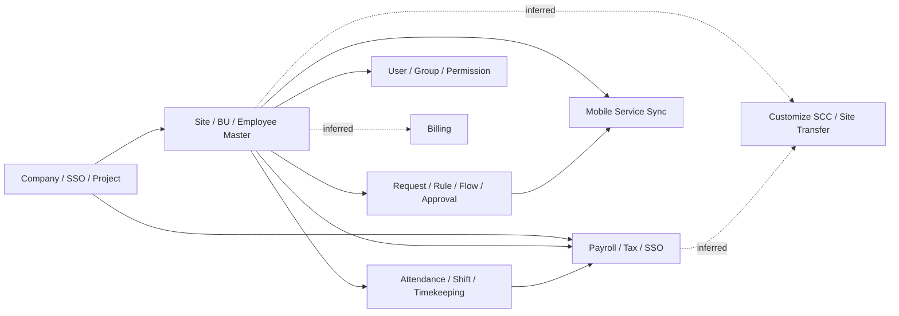
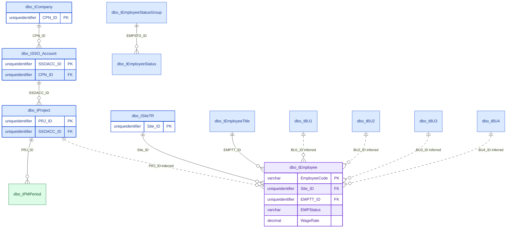
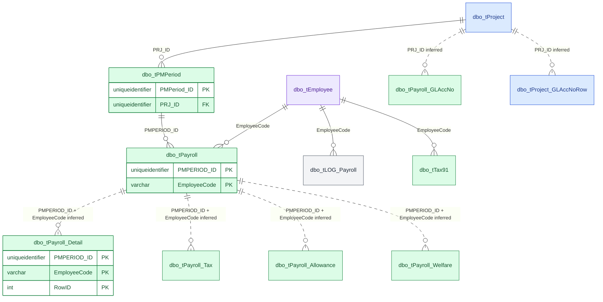
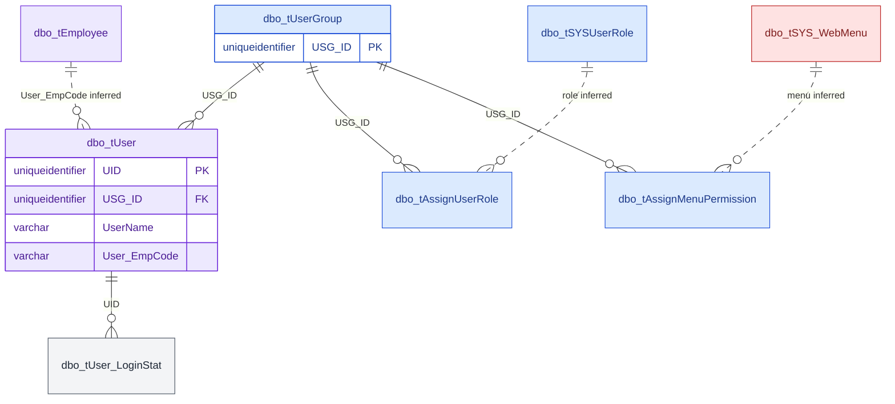
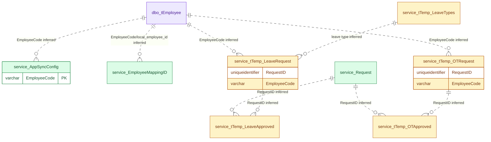
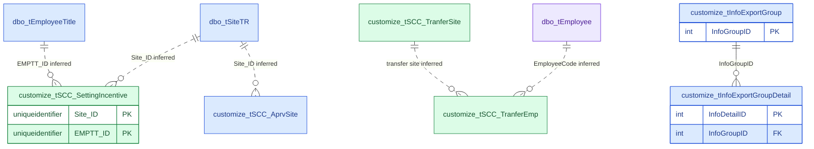
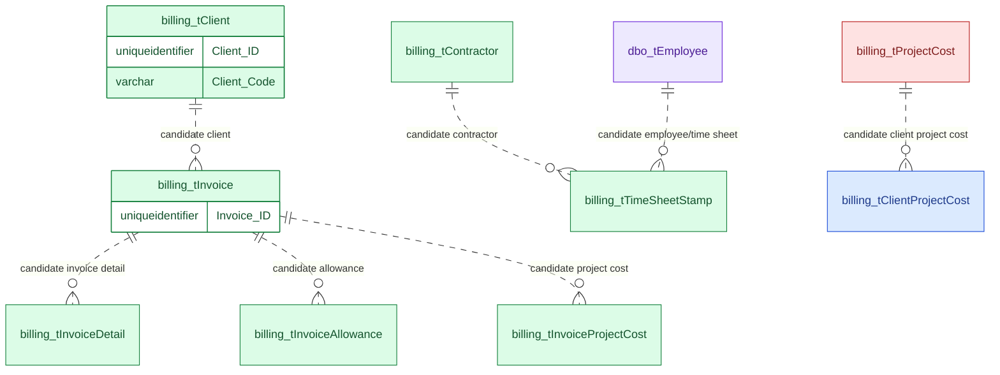

# MAS Relationship Mermaid Diagrams

Purpose: copy any Mermaid block below into Mermaid Live Editor, GitLab/GitHub Markdown, or a diagram tool that supports Mermaid.

Source:

- Declared FK metadata: `database/metadata/export-20260713/03_foreign_keys.csv`
- Column metadata: `database/metadata/export-20260713/02_columns.csv`
- Row-count/context notes: `database/metadata/export-20260713/05_row_counts.csv`
- Sample seed status: `MAS_09` loaded 288 tables / 14,232 rows from `MAS_05_top100_all_tables.txt`

Legend:

- Solid `||--o{` means declared FK exists in exported metadata.
- Dotted `||..o{` means inferred from names/keys and must be validated before using for migration logic.
- Schema dots are replaced with underscores in Mermaid entity names, for example `billing.tClient` becomes `billing_tClient`.

## Table Category Colors

Every ER diagram below colors each entity box by category, using the same classification as [10-table-categories.md](./10-table-categories.md) (full 570+ table catalog and the scoring method):

| Color | Category | Meaning |
|---|---|---|
| 🟦 blue | Master/Config | Static lookup/enum/org-structure data — safe to seed in full |
| 🟪 purple | Entity/Account | `tEmployee`/`tUser` — real people/accounts, not config |
| 🟩 green | Transaction/Fact | Business events (payroll, attendance, requests) — seed a deliberate slice only |
| ⬜ gray | Log/Audit | Change history — skip for functional seeding |
| 🟨 amber | Temp/Staging | Import/sync scratch tables — leave empty in dev seeds |
| 🟥 red | Other/Unclear | Heuristic couldn't confidently classify it — verify manually before relying on the color |

The coloring uses Mermaid `classDef`/`class`, which needs **Mermaid v10.5+** to render (Mermaid Live Editor and recent GitHub/GitLab rendering both support it). If your viewer ignores the colors, the table above and [10-table-categories.md](./10-table-categories.md) carry the same information as plain text.

## Known Seed Truncation Gaps

Full analysis: [09-data-count-summary.md](./09-data-count-summary.md).

Five master/config tables that appear as parent nodes below are only partially seeded because the `TOP 100` export cap clipped them — they have more rows in production than in the local Docker DB:

| Table | Appears in | Production | Local seed | Missing |
|---|---|---:|---:|---:|
| `tBU1` | Core Master And Employee | 532 | 100 | 432 |
| `tBU1_New` | (org hierarchy, not diagrammed) | 560 | 100 | 460 |
| `tEmployeeTitle` | Core Master And Employee, Customize SCC | 209 | 100 | 109 |
| `tResignReason` | (org/employee lookup, not diagrammed) | 678 | 100 | 578 |
| `tSiteTR` | Core Master And Employee, Attendance And Shift, Customize SCC | 187 | 100 | 87 |

`tEmployee` is also capped at 100 locally vs. 21,939 in production, but it's an entity table, not master data — pull it separately with a period-scoped or filtered slice rather than a full dump, per [07-seed-runbook.md](./07-seed-runbook.md#suggested-first-real-seed). (`tUser` is not truncated: 87 rows in both production and local.)

## Domain Overview

## Core Master And Employee

## Attendance And Shift

```mermaid
erDiagram
    dbo_tEmployee ||--o{ dbo_tTimeStamp : "CardID -> EmployeeCode"
    dbo_tEmployee ||--o{ dbo_tTimeInOut : "EmployeeCode"
    dbo_tShift ||--o{ dbo_tTimeInOut : "SHF_ID"
    dbo_tEmployee ||--o{ dbo_tAssignShift : "EmployeeCode"
    dbo_tEmployee ||--o{ dbo_tAssignShiftByWeekDay : "EmployeeCode"
    dbo_tShift ||--o{ dbo_tShiftBreak : "SHF_ID"
    dbo_tShift ||--o{ dbo_tShiftLateIn : "SHF_ID"
    dbo_tShift ||--o{ dbo_tShiftLateOut : "SHF_ID"
    dbo_tShift ||--o{ dbo_tShiftOT : "SHF_ID"
    dbo_tWorkCalendar ||--o{ dbo_tWorkCalendarDetail : "WCD_ID"
    dbo_tCostCenter ||--o{ dbo_tTimeSheet_MultiPeriod : "CostCenter_ID"
    dbo_tShift ||--o{ dbo_tTimeSheet_MultiPeriod : "SHF_ID"
    dbo_tSiteTR ||--o{ dbo_tTimeSheet_MultiPeriod : "Site_ID"

    dbo_tEmployee ||..o{ dbo_tTempBatchTime : "EmployeeCode inferred"
    dbo_tTimeInOut ||..o{ dbo_tTimeInOut_Data : "EmployeeCode + DateStamp inferred"
    dbo_tTimeInOut ||..o{ dbo_tTimeInOut_AddLeave : "EmployeeCode + DateStamp inferred"
    dbo_tEmployee ||..o{ dbo_tTemp_Leave : "EmployeeCode inferred"

    dbo_tTimeStamp {
      varchar CardID PK
      varchar Machine_ID PK
      varchar DateInput PK
      smallint nHour PK
      smallint nMinute PK
      varchar Duty PK
    }
    dbo_tTimeInOut {
      varchar EmployeeCode PK
      varchar DateStamp PK
      uniqueidentifier SHF_ID FK
    }
    dbo_tShift {
      uniqueidentifier SHF_ID PK
    }

    classDef master fill:#dbeafe,stroke:#1d4ed8,color:#1e3a8a
    classDef entity fill:#ede9fe,stroke:#6d28d9,color:#4c1d95
    classDef transaction fill:#dcfce7,stroke:#15803d,color:#14532d
    classDef log fill:#f3f4f6,stroke:#4b5563,color:#1f2937
    classDef temp fill:#fef3c7,stroke:#b45309,color:#78350f
    classDef unclear fill:#fee2e2,stroke:#b91c1c,color:#7f1d1d
    class dbo_tAssignShift transaction
    class dbo_tAssignShiftByWeekDay transaction
    class dbo_tCostCenter master
    class dbo_tEmployee entity
    class dbo_tShift master
    class dbo_tShiftBreak transaction
    class dbo_tShiftLateIn transaction
    class dbo_tShiftLateOut transaction
    class dbo_tShiftOT transaction
    class dbo_tSiteTR master
    class dbo_tTempBatchTime temp
    class dbo_tTemp_Leave temp
    class dbo_tTimeInOut transaction
    class dbo_tTimeInOut_AddLeave transaction
    class dbo_tTimeInOut_Data transaction
    class dbo_tTimeSheet_MultiPeriod transaction
    class dbo_tTimeStamp transaction
    class dbo_tWorkCalendar master
    class dbo_tWorkCalendarDetail master
```

## Payroll

## Workflow And Approval

```mermaid
erDiagram
    dbo_tRequestSystem ||--o{ dbo_tRequestType : "RequestSystemID"
    dbo_tRequestSystem ||--o{ dbo_tFlow : "RequestSystemID"
    dbo_tRequestType ||--o{ dbo_tEmployeeLevel_LeaveType : "RequestTypeID"
    dbo_tRule ||--o{ dbo_tRequest : "RuleID"
    dbo_tRule ||--o{ dbo_tFlowPath : "RuleID"
    dbo_tRule ||--o{ dbo_tCCList : "RuleID"
    dbo_tRule ||--o{ dbo_tCondition : "RuleID"
    dbo_tRequest ||--o{ dbo_tStage : "ReqID"
    dbo_tEmployee ||--o{ dbo_tApproverList : "EmployeeID"
    dbo_tApproverList ||--o{ dbo_tSelectApprover : "APPLID"
    dbo_tFlowPath ||--o{ dbo_tSelectApprover : "FlowPathID"
    dbo_tApproverGroup ||--o{ dbo_tUseList : "APPGID"
    dbo_tGroup ||--o{ dbo_tUse_Flow : "GroupID"
    dbo_tGroup ||--o{ dbo_tManager : "GroupID"

    dbo_tEmployee ||..o{ dbo_tRequest : "requester/employee code inferred"
    dbo_tEmployee ||..o{ dbo_tStage : "approver/employee code inferred"

    dbo_tRequest {
      uniqueidentifier RequestID PK
      uniqueidentifier RuleID FK
    }
    dbo_tStage {
      uniqueidentifier StageID PK
      uniqueidentifier ReqID FK
    }

    classDef master fill:#dbeafe,stroke:#1d4ed8,color:#1e3a8a
    classDef entity fill:#ede9fe,stroke:#6d28d9,color:#4c1d95
    classDef transaction fill:#dcfce7,stroke:#15803d,color:#14532d
    classDef log fill:#f3f4f6,stroke:#4b5563,color:#1f2937
    classDef temp fill:#fef3c7,stroke:#b45309,color:#78350f
    classDef unclear fill:#fee2e2,stroke:#b91c1c,color:#7f1d1d
    class dbo_tApproverGroup master
    class dbo_tApproverList master
    class dbo_tCCList master
    class dbo_tCondition master
    class dbo_tEmployee entity
    class dbo_tEmployeeLevel_LeaveType master
    class dbo_tFlow master
    class dbo_tFlowPath master
    class dbo_tGroup master
    class dbo_tManager master
    class dbo_tRequest transaction
    class dbo_tRequestSystem master
    class dbo_tRequestType master
    class dbo_tRule master
    class dbo_tSelectApprover master
    class dbo_tStage transaction
    class dbo_tUseList master
    class dbo_tUse_Flow master
```

## Security

## Service And Mobile Sync

## Customize SCC

## Billing Gap Map

Billing has 20 tables in the metadata package, but exported PK/FK metadata and row counts are empty. Treat this diagram as a candidate model only.

## Declared FK Diagram

This block contains the exported FK graph only. It is useful when you want a constraint-level view without inferred links.

```mermaid
erDiagram
    dbo_tEmployee ||--o{ dbo_tApproverList : "EmployeeID -> EmployeeCode"
    dbo_tEmployee ||--o{ dbo_tAssignChargeRate : "EmployeeCode"
    dbo_tUserGroup ||--o{ dbo_tAssignMenuPermission : "USG_ID"
    dbo_tEmployee ||--o{ dbo_tAssignShift : "EmployeeCode"
    dbo_tEmployee ||--o{ dbo_tAssignShiftByWeekDay : "EmployeeCode"
    dbo_tUserGroup ||--o{ dbo_tAssignUserRole : "USG_ID"
    dbo_tRule ||--o{ dbo_tCCList : "RuleID"
    dbo_tRule ||--o{ dbo_tCondition : "RuleID"
    dbo_tEmployeeTitle ||--o{ dbo_tEmployee : "EMPTT_ID"
    dbo_tSiteTR ||--o{ dbo_tEmployee : "Site_ID"
    dbo_tRequestType ||--o{ dbo_tEmployeeLevel_LeaveType : "RequestTypeID"
    dbo_tEmployee ||--o{ dbo_tEmployeePhoto : "EmployeeCode"
    dbo_tEmployeeStatusGroup ||--o{ dbo_tEmployeeStatus : "EMPSTG_ID"
    dbo_tEmployeeLevel_LeaveType ||--o{ dbo_tEmployeeWork_Quota : "EMPLLT_ID"
    dbo_tRequestSystem ||--o{ dbo_tFlow : "RequestSystemID"
    dbo_tRule ||--o{ dbo_tFlowPath : "RuleID"
    dbo_tImportPlan ||--o{ dbo_tImportPlan : "EmployeeCode"
    dbo_tImportPlan ||--o{ dbo_tImportPlan : "DateStamp"
    dbo_tEmployee ||--o{ dbo_tLOG_Payroll : "EmployeeCode"
    dbo_tGroup ||--o{ dbo_tManager : "GroupID"
    dbo_tEmployee ||--o{ dbo_tManager_Delegated : "EmployeeCode"
    dbo_tEmployee ||--o{ dbo_tPayroll : "EmployeeCode"
    dbo_tPMPeriod ||--o{ dbo_tPayroll : "PMPERIOD_ID"
    dbo_tProject ||--o{ dbo_tPMPeriod : "PRJ_ID"
    dbo_tSSO_Account ||--o{ dbo_tProject : "SSOACC_ID"
    dbo_tEmployee ||--o{ dbo_tPunishment : "EmployeeCode"
    dbo_tGUILTY_Type ||--o{ dbo_tPunishment : "GUILTY_TYPE_ID"
    dbo_tReimType ||--o{ dbo_tReim : "REIM_TYPE_ID"
    dbo_tReim ||--o{ dbo_tReimRef : "REIM_ID"
    dbo_tRule ||--o{ dbo_tRequest : "RuleID"
    dbo_tRequestSystem ||--o{ dbo_tRequestType : "RequestSystemID"
    dbo_tEmployee ||--o{ dbo_tReward : "EmployeeCode"
    dbo_tPERFORMANCE_Type ||--o{ dbo_tReward : "PERFORMANCE_TYPE_ID"
    dbo_tApproverList ||--o{ dbo_tSelectApprover : "APPLID"
    dbo_tFlowPath ||--o{ dbo_tSelectApprover : "FlowPathID"
    dbo_tShift ||--o{ dbo_tShiftBreak : "SHF_ID"
    dbo_tShift ||--o{ dbo_tShiftLateIn : "SHF_ID"
    dbo_tShift ||--o{ dbo_tShiftLateOut : "SHF_ID"
    dbo_tShift ||--o{ dbo_tShiftOT : "SHF_ID"
    dbo_tSiteUpdatePlan ||--o{ dbo_tSiteUpdate : "SiteUpdatePlanID"
    dbo_tSiteUpdatePlan ||--o{ dbo_tSiteUpdatePlan : "PredecessorID"
    dbo_tCompany ||--o{ dbo_tSSO_Account : "CPN_ID"
    dbo_tRequest ||--o{ dbo_tStage : "ReqID"
    dbo_tEmployee ||--o{ dbo_tTax91 : "EmployeeCode"
    dbo_tEmployee ||--o{ dbo_tTimeInOut : "EmployeeCode"
    dbo_tShift ||--o{ dbo_tTimeInOut : "SHF_ID"
    dbo_tCostCenter ||--o{ dbo_tTimeSheet_MultiPeriod : "CostCenter_ID"
    dbo_tShift ||--o{ dbo_tTimeSheet_MultiPeriod : "SHF_ID"
    dbo_tSiteTR ||--o{ dbo_tTimeSheet_MultiPeriod : "Site_ID"
    dbo_tEmployee ||--o{ dbo_tTimeStamp : "CardID"
    dbo_tGroup ||--o{ dbo_tUse_Flow : "GroupID"
    dbo_tApproverGroup ||--o{ dbo_tUseList : "APPGID"
    dbo_tUserGroup ||--o{ dbo_tUser : "USG_ID"
    dbo_tUser ||--o{ dbo_tUser_LoginStat : "UID"
    dbo_tWorkCalendar ||--o{ dbo_tWorkCalendarDetail : "WCD_ID"

    classDef master fill:#dbeafe,stroke:#1d4ed8,color:#1e3a8a
    classDef entity fill:#ede9fe,stroke:#6d28d9,color:#4c1d95
    classDef transaction fill:#dcfce7,stroke:#15803d,color:#14532d
    classDef log fill:#f3f4f6,stroke:#4b5563,color:#1f2937
    classDef temp fill:#fef3c7,stroke:#b45309,color:#78350f
    classDef unclear fill:#fee2e2,stroke:#b91c1c,color:#7f1d1d
    class dbo_tApproverGroup master
    class dbo_tApproverList master
    class dbo_tAssignChargeRate transaction
    class dbo_tAssignMenuPermission master
    class dbo_tAssignShift transaction
    class dbo_tAssignShiftByWeekDay transaction
    class dbo_tAssignUserRole master
    class dbo_tCCList master
    class dbo_tCompany master
    class dbo_tCondition master
    class dbo_tCostCenter master
    class dbo_tEmployee entity
    class dbo_tEmployeeLevel_LeaveType master
    class dbo_tEmployeePhoto transaction
    class dbo_tEmployeeStatus master
    class dbo_tEmployeeStatusGroup master
    class dbo_tEmployeeTitle master
    class dbo_tEmployeeWork_Quota master
    class dbo_tFlow master
    class dbo_tFlowPath master
    class dbo_tGUILTY_Type master
    class dbo_tGroup master
    class dbo_tImportPlan transaction
    class dbo_tLOG_Payroll log
    class dbo_tManager master
    class dbo_tManager_Delegated unclear
    class dbo_tPERFORMANCE_Type master
    class dbo_tPMPeriod transaction
    class dbo_tPayroll transaction
    class dbo_tProject master
    class dbo_tPunishment transaction
    class dbo_tReim transaction
    class dbo_tReimRef transaction
    class dbo_tReimType master
    class dbo_tRequest transaction
    class dbo_tRequestSystem master
    class dbo_tRequestType master
    class dbo_tReward transaction
    class dbo_tRule master
    class dbo_tSSO_Account master
    class dbo_tSelectApprover master
    class dbo_tShift master
    class dbo_tShiftBreak transaction
    class dbo_tShiftLateIn transaction
    class dbo_tShiftLateOut transaction
    class dbo_tShiftOT transaction
    class dbo_tSiteTR master
    class dbo_tSiteUpdate master
    class dbo_tSiteUpdatePlan transaction
    class dbo_tStage transaction
    class dbo_tTax91 transaction
    class dbo_tTimeInOut transaction
    class dbo_tTimeSheet_MultiPeriod transaction
    class dbo_tTimeStamp transaction
    class dbo_tUseList master
    class dbo_tUse_Flow master
    class dbo_tUser entity
    class dbo_tUserGroup master
    class dbo_tUser_LoginStat log
    class dbo_tWorkCalendar master
    class dbo_tWorkCalendarDetail master
```

## Suggested Next Diagram

For development planning, the most useful next diagram is a period-scoped flow:

`tEmployee -> tTimeInOut/tTimeStamp -> tPMPeriod -> tPayroll -> tPayroll_Detail -> request/leave/OT`.

That diagram should be generated from a coherent seed slice, not just `TOP 100`, because cross-table rows need to refer to the same employees and periods.
